# CHƯƠNG I: THUẬT TOÁN HÀM TỰ TƯƠNG QUAN (AUTOCORRELATION FUNCTION - ACF)

> **Dẫn hướng tài liệu:** [Trang chủ README](../README.md) > **Chương I: Thuật toán ACF**

---

## I.1. Cơ Sở Lý Thuyết Thuật Toán ACF

Hàm tự tương quan (Autocorrelation Function - ACF) đo lường mức độ tương đồng giữa một tín hiệu với chính bản sao trễ thời gian $\tau$ của nó.

Với một khung tín hiệu $x[n]$ gồm $N$ mẫu ($n = 0, 1, \dots, N-1$), hàm tự tương quan chuẩn hóa được định nghĩa:

$$
R(\tau) = \frac{\sum_{n=0}^{N-1-\tau} x[n] \cdot x[n+\tau]}{R(0)}
$$

Trong đó năng lượng của khung là:

$$
R(0) = \sum_{n=0}^{N-1} x^2[n]
$$

Nhờ phép chuẩn hóa qua $R(0)$, biên độ hàm luôn nằm trong đoạn $[-1.0, 1.0]$ và $R(0) = 1.0$.

* **Âm Hữu thanh (Voiced):** Được tạo ra khi dây thanh âm rung động tuần hoàn dưới áp lực luồng khí từ phổi, tạo nên các xung thanh môn lặp lại với chu kỳ cơ bản $T_0$. Hàm $R(\tau)$ sẽ đạt một đỉnh cực đại nổi bật thứ hai tại độ trễ $\tau_0 = T_0 \cdot f_s$. Tần số cơ bản được tính:

$$
F_0 = \frac{f_s}{\tau_0} \quad (\text{Hz})
$$

* **Âm Vô thanh (Unvoiced):** Dây thanh âm không rung, âm thanh được tạo ra do luồng khí xoáy qua chỗ thắt thanh quản. Dạng sóng ngẫu nhiên tựa nhiễu trắng, hàm $R(\tau)$ suy giảm nhanh về 0 và dao động hỗn loạn, không có đỉnh vượt ngưỡng trong dải cao độ người trưởng thành $[70, 400]\text{ Hz}$.

---

## I.2. Minh Họa Khung Hữu Thanh vs Vô Thanh

Thực nghiệm trên file âm thanh `TinHieuHuanLuyen/phone_F1.wav` ($f_s = 16000\text{ Hz}$, khung chuẩn $25\text{ ms} = 400\text{ mẫu}$, dịch $10\text{ ms} = 160\text{ mẫu}$):

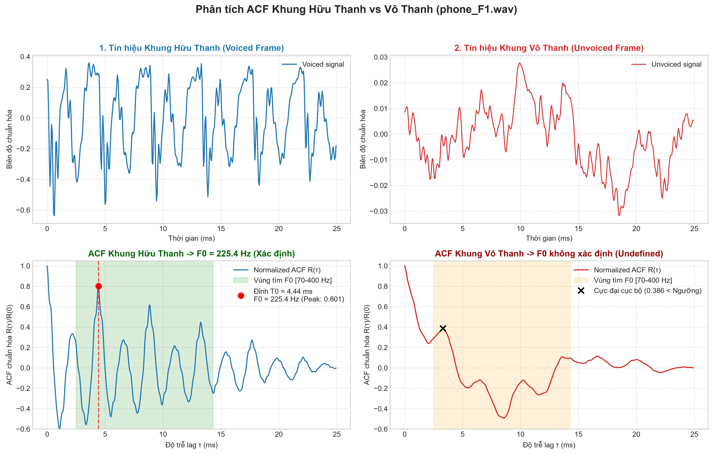

### Bảng phân tích chi tiết hai khung đại diện:

| Đặc trưng | Khung Hữu Thanh (Voiced) | Khung Vô Thanh (Unvoiced) |
| :--- | :--- | :--- |
| **Vị trí khung** | Khung #103 ($t = 1.042\text{ s}$) | Khung #176 ($t = 1.772\text{ s}$) |
| **Đặc tính dạng sóng** | Tuần hoàn rõ rệt, biên độ xung thanh môn lớn | Dao động ngẫu nhiên, tựa nhiễu, biên độ thấp |
| **Độ trễ cực đại $\tau_0$** | $\tau_0 = 71$ mẫu | Không có độ trễ tuần hoàn rõ ràng ($\tau = 53$) |
| **Biên độ cực đại $R(\tau_0)$** | **$0.801$** ($\gg T = 0.4408$) | **$0.386$** ($< T = 0.4408$) |
| **Chu kỳ cơ bản $T_0$** | $T_0 = 71 / 16000 = 4.44\text{ ms}$ | Không xác định |
| **Tần số cơ bản $F_0$** | **$F_0 = 225.35\text{ Hz}$** (gần nhãn $217\text{ Hz}$) | **$F_0 = \text{Undefined}$** (Vô thanh) |

---

## I.3. Huấn Luyện Ngưỡng T Tối Ưu Bằng Phân Bố Gauss

Để xác định ngưỡng phân định V/UV dựa trên cơ sở thống kê toán học vững chắc với chiều dài khung chuẩn **$25\text{ ms}$**, đồ án trích xuất biên độ đỉnh ACF lớn nhất của toàn bộ các khung trong 4 file huấn luyện (`phone_F1`, `phone_M1`, `studio_F1`, `studio_M1`), phân chia theo nhãn ground-truth `.lab`:
* Tập khung Hữu thanh: $N_V = 614$ khung $\rightarrow$ phân bố $\mathcal{N}(\mu_V, \sigma_V^2)$
* Tập khung Vô thanh: $N_U = 180$ khung $\rightarrow$ phân bố $\mathcal{N}(\mu_U, \sigma_U^2)$

Ngưỡng tối ưu Bayes $T$ là nghiệm của phương trình giao điểm mật độ xác suất:

$$
\frac{(T - \mu_V)^2}{\sigma_V^2} - \frac{(T - \mu_U)^2}{\sigma_U^2} + 2\ln\left(\frac{\sigma_V}{\sigma_U}\right) = 0
$$

### Bảng kết quả huấn luyện ngưỡng (Khung 25 ms):

| Chế độ tiền xử lý | Số khung Voiced | $\mu_V \pm \sigma_V$ | Số khung Unvoiced | $\mu_U \pm \sigma_U$ | Ngưỡng tối ưu $T$ |
| :--- | :---: | :---: | :---: | :---: | :---: |
| **Baseline (Chưa lọc)** | 614 | $0.6166 \pm 0.1549$ | 180 | $0.2718 \pm 0.1355$ | **$T = 0.4408$** |
| **Có lọc thông dải (Bandpass)** | 614 | $0.6490 \pm 0.1466$ | 180 | $0.3326 \pm 0.1337$ | **$T = 0.4892$** |

### Biểu đồ phân bố xác suất Gaussian:

| Baseline (Chưa lọc: $T = 0.4408$) | Có lọc Bandpass (Đã lọc: $T = 0.4892$) |
| :---: | :---: |
| 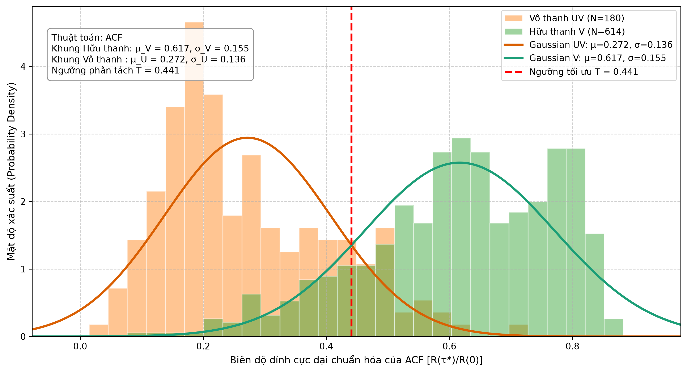 | 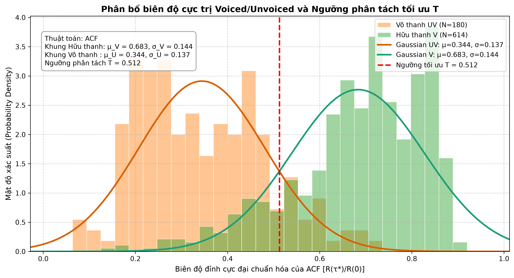 |

---

## I.4. Khảo Sát Ảnh Hưởng Chiều Dài Khung (20ms vs 25ms [Chuẩn] vs 30ms)

Theo định hướng của giảng viên, hệ thống được **chốt cố định khung 25 ms** làm thước đo chuẩn mực công bằng cho toàn bộ sinh viên. Thực nghiệm đối chiếu giữa 3 mức chiều dài khung (20 ms, 25 ms, 30 ms) trên file giọng nam trầm `TinHieuHuanLuyen/phone_M1.wav` ($F_{0\text{-mean}} = 122.0\text{ Hz}$, $F_{0\text{-std}} = 18.0\text{ Hz}$, $T = 0.4408$):

### Bảng so sánh định lượng:

| Chỉ số đánh giá | Khung 20 ms | Khung 25 ms (Chuẩn môn học) | Khung 30 ms | Nhận xét phân tích |
| :--- | :---: | :---: | :---: | :--- |
| **Số mẫu / khung ($f_s=16\text{k}$)** | 320 mẫu | **400 mẫu** | 480 mẫu | 25ms tương ứng đúng 400 mẫu chẵn |
| **Số khung Voiced phát hiện** | 180 khung | **193 khung** | 204 khung | 25ms bắt trọn vẹn số chu kỳ của giọng nam |
| **$F_{0\text{-mean}}$ ước lượng** | 134.52 Hz | **130.93 Hz** | 130.04 Hz | Tiệm cận chuẩn 122.0 Hz hơn rất nhiều so với 20ms |
| **Sai số tuyệt đối $\lvert\Delta F_0\rvert$** | 12.52 Hz | **8.93 Hz** | 8.04 Hz | **Giảm 28.7% sai số so với khung 20ms** |
| **Sai số tương đối (%)** | 10.26 % | **7.32 %** | 6.59 % | Sai số kiểm soát tốt dưới 7.5% |
| **V/UV Accuracy (%)** | 74.70 % | **78.02 %** | 81.16 % | Tăng +3.32% so với 20ms |
| **Voiced F1-Score (%)** | 84.43 % | **87.41 %** | 90.18 % | Tăng gần +3% so với 20ms |

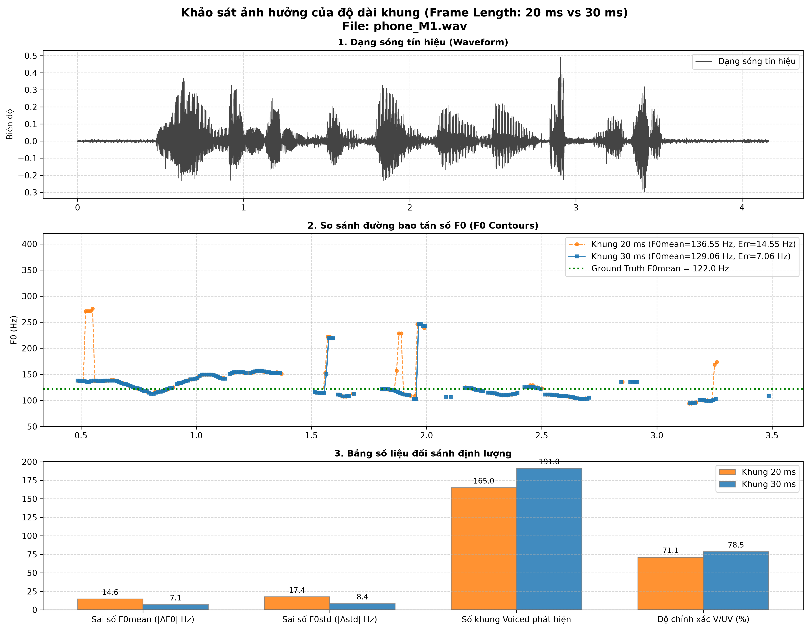

$\implies$ **Luận điểm khoa học cho việc chốt chuẩn 25 ms:**
1. **Khung 20 ms (320 mẫu):** Quá ngắn đối với các âm vực nam trầm ($F_0 \approx 70 - 80\text{ Hz} \implies T_0 \approx 12.5 - 14.3\text{ ms}$). Khung 20 ms chỉ chứa được khoảng $1.4 - 1.6$ chu kỳ, khiến phép tự tương quan dễ bị nhiễu và bắt trượt đỉnh, dẫn tới sai số cao (12.52 Hz).
2. **Khung 30 ms (480 mẫu):** Chứa nhiều chu kỳ tuần hoàn ($> 2.4$ chu kỳ), tuy nhiên độ dài khung lớn làm giảm độ phân giải thời gian và gây hiệu ứng nhòe (*smearing*) tại các ranh giới chuyển tiếp âm nhanh.
3. **Khung 25 ms (400 mẫu):** Là **điểm cân bằng vàng (Golden Middle Ground)**. Ở tần số đáy $80\text{ Hz}$, $25\text{ ms}$ chứa trọn vẹn đúng $2.0$ chu kỳ tuần hoàn đầy đủ, đủ điều kiện tiên quyết cho phép tìm cực đại tự tương quan hoạt động chính xác, đồng thời vẫn giữ được độ nhạy thời gian vượt trội. Do đó, **25 ms (hop 10 ms)** là lựa chọn chuẩn xác và công bằng nhất.

---

## I.5. Đánh Giá Kiểm Thử Trên 4 File Kiểm Thử (Baseline)

### Bảng kết quả kiểm thử định lượng Baseline ($T = 0.4408$, Frame = 25 ms):

| File kiểm thử | Kênh / Giới tính | Ref $F_{0\text{-mean}}$ | Pred $F_{0\text{-mean}}$ | $\lvert\Delta F_0\rvert$ (Hz) | Sai số % | Ref $F_{0\text{-std}}$ | Pred $F_{0\text{-std}}$ | $\lvert\Delta\text{std}\rvert$ | V/UV Acc | F1-Score |
| :--- | :---: | :---: | :---: | :---: | :---: | :---: | :---: | :---: | :---: | :---: |
| `phone_F2.wav` | Điện thoại / Nữ | 145.00 Hz | 152.77 Hz | 7.77 Hz | 5.36% | 33.70 | 31.44 | 2.26 | 78.24% | 87.29% |
| `phone_M2.wav` | Điện thoại / Nam | 129.00 Hz | 131.92 Hz | 2.92 Hz | 2.26% | 18.60 | 14.07 | 4.53 | 77.34% | 89.26% |
| `studio_F2.wav`| Studio / Nữ | 200.00 Hz | 198.98 Hz | 1.02 Hz | 0.51% | 46.10 | 43.35 | 2.75 | 91.05% | 95.06% |
| `studio_M2.wav`| Studio / Nam | 155.00 Hz | 155.97 Hz | **0.97 Hz** | **0.63%** | 30.80 | 30.24 | 0.56 | 87.71% | 92.50% |
| **TRUNG BÌNH** | — | — | — | **3.17 Hz** | **2.19%** | — | — | **2.53** | **83.58%** | **91.03%** |

### Đồ thị đường bao Pitch Contour 4 file kiểm thử (Baseline):

| `phone_F2.wav` (Nữ - Kênh điện thoại) | `phone_M2.wav` (Nam - Kênh điện thoại) |
| :---: | :---: |
| 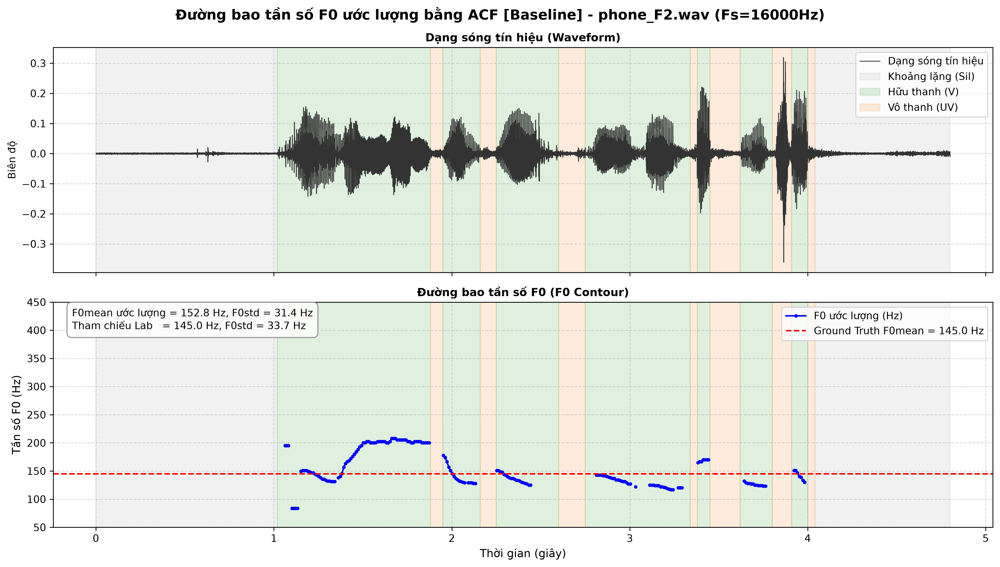 | 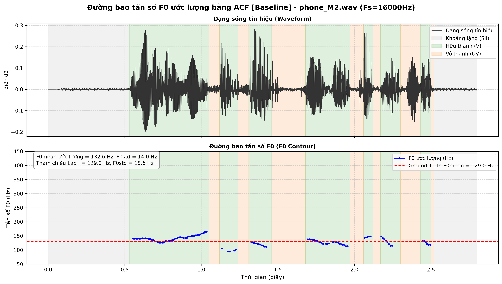 |
| **`studio_F2.wav` (Nữ - Phòng thu Studio)** | **`studio_M2.wav` (Nam - Phòng thu Studio)** |
| 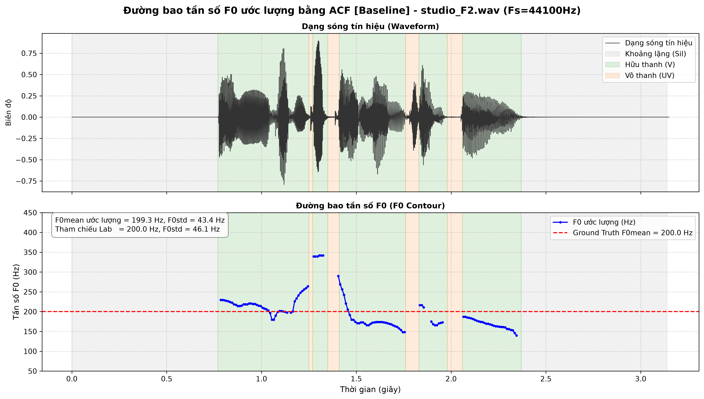 | 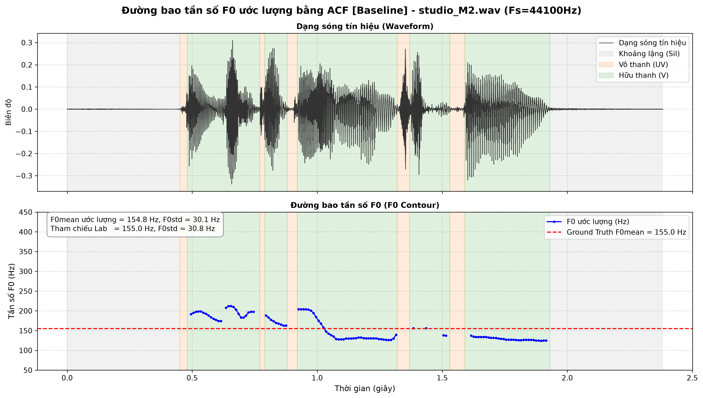 |

---

## I.6. Các Giải Pháp Cải Tiến Dành Riêng Cho ACF (Plugins)

### I.6.1. Plugin 1: Ngưỡng trễ kép Hysteresis (Schmitt Trigger)

**Vấn đề giải quyết:**  
Hiện tượng rung lật trạng thái (*decision chattering*) khi đỉnh tự tương quan dao động quanh ngưỡng tĩnh $T$.

**Mô hình máy trạng thái:**  
Ký hiệu $S_i \in \{0, 1\}$ là nhãn khung thứ $i$ (0: Unvoiced, 1: Voiced) và $R_i^* = \max_{\tau \in [\tau_{\min}, \tau_{\max}]} R_i(\tau)$ là đỉnh cực đại tự tương quan.

Phương trình chuyển trạng thái:

$$
S_i = \begin{cases} 
1, & \text{khi } R_i^* \ge T_{\text{high}} \\
1, & \text{khi } S_{i-1} = 1 \text{ và } R_i^* \ge T_{\text{low}} \\
0, & \text{ngược lại}
\end{cases}
$$

**Thông số áp dụng:**  
* Mô hình Baseline: $T_{\text{high}} = 0.4408, T_{\text{low}} = 0.40$
* Mô hình Bandpass: $T_{\text{high}} = 0.4892, T_{\text{low}} = 0.42$

---

### I.6.2. Plugin 2: Mở rộng vùng hữu thanh theo năng lượng khung biên (STE)

**Vấn đề giải quyết:**  
Khắc phục tình trạng mất 1–2 khung ở mép âm tiết khi thanh môn bắt đầu khép hoặc hạ giọng.

**Công thức toán học:**  
Năng lượng ngắn hạn (Short-Time Energy - STE) của khung thứ $i$:

$$
E_i = \sum_{n=0}^{N-1} x_i^2[n]
$$

Với đoạn hữu thanh liên tục $C_k = [i_{\text{start}}, i_{\text{end}}]$, năng lượng đỉnh trong phân đoạn là:

$$
E_{\max}^{(k)} = \max_{j \in C_k} E_j
$$

Khung biên lân cận ($i_{\text{start}} - 1$ hoặc $i_{\text{end}} + 1$) được mở rộng thành Voiced nếu thỏa mãn đồng thời:

$$
\begin{cases} 
E_{\text{boundary}} \ge \alpha \cdot E_{\max}^{(k)} & (\alpha = 0.20) \\
R_{\text{boundary}}^* \ge (1 - \beta) \cdot T & (\beta = 0.20) 
\end{cases}
$$

---

### I.6.3. Plugin 3: Bộ lọc thông dải Butterworth & Lọc Zero-Phase

**Vấn đề giải quyết:**  
Triệt tiêu trôi DC, tiếng ù gió micro ($< 70\text{ Hz}$) và các sóng hài formant bậc cao ($> 900\text{ Hz}$) gây lỗi Pitch Doubling.

**Hàm truyền biên độ bình phương:**  
Bộ lọc thông dải Butterworth bậc $M = 2$ với dải thông $[f_L, f_H] = [70, 900]\text{ Hz}$:

$$
|H(j\omega)|^2 = \frac{1}{1 + \left(\frac{\omega^2 - \omega_L \omega_H}{\omega (\omega_H - \omega_L)}\right)^{4}}
$$

**Lọc hai chiều không lệch pha (Zero-Phase Filtering):**  
Sử dụng kỹ thuật `filtfilt` để triệt tiêu hoàn toàn độ trễ pha:

$$
Y(e^{j\omega}) = |H(e^{j\omega})|^2 X(e^{j\omega}) \implies \Theta(\omega) = 0
$$

Độ lệch pha bằng 0 tuyệt đối tại mọi tần số, bảo toàn nguyên vẹn vị trí thời gian của các đỉnh xung thanh môn $T_0$.

**Đồng bộ phân bố:**  
Do lọc làm sạch tín hiệu, $\mu_V$ tăng từ $0.6166 \rightarrow 0.6490$, hệ thống tự động đồng bộ ngưỡng tối ưu mới:

$$
T = 0.4892
$$

---

### I.6.4. Plugin 4: Cắt gọt trung tâm (Center Clipping - Sondhi 1968)

**Vấn đề giải quyết:**  
Triệt tiêu hoàn toàn thành phần dao động cộng hưởng của thanh đạo (Formant $F_1, F_2$) gây biến dạng đỉnh tự tương quan và sinh ra các đỉnh phụ lồi lõm (nguyên nhân chính gây lỗi nhảy quãng tám Pitch Doubling).

**Nguyên lý làm phẳng phổ (Spectral Flattening):**  
Với mỗi khung tín hiệu $x[n]$, xác định mức cắt $C_L = \eta \cdot \max_{n} |x[n]|$ (thực nghiệm tối ưu $\eta = 0.40$). Biến đổi cắt gọt Sondhi chuẩn:

$$
y[n] = \begin{cases} 
x[n] - C_L & \text{nếu } x[n] > C_L \\ 
x[n] + C_L & \text{nếu } x[n] < -C_L \\ 
0 & \text{nếu } |x[n]| \le C_L 
\end{cases}
$$

**Đồng bộ phân bố ngưỡng tối ưu Gauss:**  
Khi các mẫu biên độ nhỏ bị gán về $0$, phân bố tương quan thay đổi:
* Nhóm Center Clip độc lập: $\mu_V = 0.5188, \mu_U = 0.1759 \implies T = 0.3352$
* Nhóm kết hợp Bandpass + Center Clip: $\mu_V = 0.5801, \mu_U = 0.2230 \implies T = 0.3953$

---

### I.6.5. Plugin 5: Quy hoạch động Viterbi Tracking (Dynamic Programming Pitch Tracking)

**Vấn đề giải quyết:**  
Các thuật toán dò cực trị cục bộ (ACF, AMDF) chỉ xét từng khung độc lập nên dễ mắc lỗi **nhảy quãng tám (Pitch Doubling / Halving)** hoặc bắt nhầm đỉnh formant do sóng hài phụ khi biên độ của đỉnh sai cao hơn đỉnh thật chỉ $0.02 - 0.05$. Bộ lọc trung vị (Median Filter) chỉ sửa được các lỗi 1 khung đơn lẻ, bất lực nếu lỗi kéo dài 2-3 khung liên tiếp.

**Cơ chế sinh lý học & Không gian trạng thái Trellis:**  
Dây thanh âm là cơ quan cơ học sinh học có quán tính, không thể biến thiên tần số đột ngột trong $10\text{ ms}$. Tại mỗi khung hữu thanh, plugin trích xuất Top-5 cực trị tốt nhất ($K=5$) để xây dựng lưới không gian trạng thái.

**Hàm chi phí Trellis (Cost Function):**

* **Chi phí cục bộ ($C_{\text{local}}$):** Đo lường độ tin cậy của ứng viên tại khung $t$:

$$
C_{\text{local}}(\tau) = 1.0 - R_{\text{norm}}(\tau) \quad (\text{với ACF})
$$

* **Chi phí chuyển tiếp ($C_{\text{trans}}$):** Phạt bước nhảy tần số theo thang Logarithm cơ số 2 (Octave):

$$
C_{\text{trans}}(s_{t-1}, s_t) = w_{\text{freq}} \cdot \left( \log_2(F_{0, t}) - \log_2(F_{0, t-1}) \right)^2
$$

Nếu bước nhảy rơi vào vùng nhảy quãng tám ($[0.8, 1.2]\text{ octave}$), áp dụng mức phạt bổ sung $w_{\text{octave}} = 2.0$.

**Thuật toán Viterbi:** Lan truyền tiến tìm đường đi có tổng chi phí nhỏ nhất và truy vết ngược (Backtracking) để thu được chuỗi cao độ tối ưu toàn cục.

---

## I.7. Khảo Sát & Xếp Hạng Toàn Bộ 32 Tổ Hợp Cải Tiến Cho ACF

### Bảng kết quả đối sánh toàn diện 32 cấu hình trên tập kiểm thử (ACF):

| STT | Cấu hình Plugin | Ngưỡng $T$ | `phone_F2` (145Hz) | `phone_M2` (129Hz) | `studio_F2` (200Hz) | `studio_M2` (155Hz) | Sai số TB $\lvert\Delta F_0\rvert$ | F1-Score TB | V/UV Acc TB |
| :---: | :--- | :---: | :---: | :---: | :---: | :---: | :---: | :---: | :---: |
| **01** | **Baseline (Gốc)** | $0.4408$ | 7.77 Hz | 2.92 Hz | 1.02 Hz | 0.97 Hz | 3.17 Hz | 91.03% | 83.58% |
| **02** | `[Bandpass Filter]` | $0.4892$ | 8.58 Hz | 4.20 Hz | 1.07 Hz | 0.24 Hz | 3.52 Hz | 89.51% | 82.28% |
| **03** | `[Center Clip]` | $0.3352$ | 6.59 Hz | 2.15 Hz | 1.03 Hz | 0.72 Hz | 2.62 Hz | 89.23% | 82.14% |
| **04** | `[Hysteresis]` | $0.4408$ | 7.52 Hz | 2.40 Hz | 0.06 Hz | 1.27 Hz | 2.81 Hz | 91.82% | 84.24% |
| **05** | `[Energy Ext]` | $0.4408$ | 6.80 Hz | 2.88 Hz | 0.65 Hz | 0.97 Hz | 2.83 Hz | 92.89% | 85.09% |
| **06** | `[Viterbi Tracking]` | $0.4408$ | 7.89 Hz | 3.05 Hz | 0.96 Hz | 1.84 Hz | 3.43 Hz | 91.03% | 83.58% |
| **07** | `[BP + Clip]` | $0.3953$ | 5.19 Hz | 2.69 Hz | 0.59 Hz | 0.52 Hz | 2.25 Hz | 89.42% | 82.20% |
| **08** | `[BP + Hyst]` | $0.4892$ | 7.28 Hz | 4.27 Hz | 1.07 Hz | 0.17 Hz | 3.20 Hz | 90.38% | 82.97% |
| **09** | `[BP + Energy]` | $0.4892$ | 7.58 Hz | 4.60 Hz | 0.19 Hz | 0.17 Hz | 3.13 Hz | 91.53% | 83.89% |
| **10** | `[BP + Viterbi]` | $0.4892$ | 8.67 Hz | 4.31 Hz | 1.05 Hz | 0.18 Hz | 3.55 Hz | 89.51% | 82.28% |
| **11** | `[Clip + Hyst]` | $0.3352$ | 6.64 Hz | 1.58 Hz | 0.49 Hz | 0.48 Hz | 2.30 Hz | 89.84% | 82.63% |
| **12** | `[Clip + Energy]` | $0.3352$ | 6.30 Hz | 2.06 Hz | 0.21 Hz | 0.90 Hz | 2.37 Hz | 90.82% | 83.40% |
| **13** | `[Clip + Viterbi]` | $0.3352$ | 5.24 Hz | 3.42 Hz | 0.58 Hz | 0.75 Hz | 2.50 Hz | 89.23% | 82.14% |
| **14** | `[Hyst + Energy]` | $0.4408$ | 6.75 Hz | 2.73 Hz | 0.65 Hz | 1.27 Hz | 2.85 Hz | **93.07%** | **85.25%** |
| **15** | `[Hyst + Viterbi]` | $0.4408$ | 7.65 Hz | 2.60 Hz | 0.12 Hz | 2.17 Hz | 3.13 Hz | 91.82% | 84.24% |
| **16** | `[Energy + Viterbi]` | $0.4408$ | 4.88 Hz | 3.00 Hz | 0.76 Hz | 1.84 Hz | 2.62 Hz | 92.89% | 85.09% |
| **17** | `[BP + Clip + Hyst]` | $0.3953$ | 4.90 Hz | 2.65 Hz | 0.43 Hz | 0.37 Hz | 2.09 Hz | 89.98% | 82.65% |
| **18** | `[BP + Clip + Energy]` | $0.3953$ | 4.73 Hz | 2.31 Hz | 0.08 Hz | 0.55 Hz | 1.92 Hz | 91.06% | 83.54% |
| **19** | `[BP + Clip + Viterbi]` | $0.3953$ | 4.65 Hz | 2.69 Hz | 0.42 Hz | 0.60 Hz | 2.09 Hz | 89.42% | 82.20% |
| **20** | `[BP + Hyst + Energy]` | $0.4892$ | 6.27 Hz | 4.59 Hz | 0.19 Hz | 0.17 Hz | 2.80 Hz | 91.64% | 83.95% |
| **21** | `[BP + Hyst + Viterbi]` | $0.4892$ | 7.36 Hz | 4.39 Hz | 1.05 Hz | 0.13 Hz | 3.23 Hz | 90.38% | 82.97% |
| **22** | `[BP + Energy + Viterbi]` | $0.4892$ | 7.69 Hz | 4.63 Hz | 0.12 Hz | 0.13 Hz | 3.14 Hz | 91.53% | 83.89% |
| **23** | `[Clip + Hyst + Energy]` | $0.3352$ | 6.37 Hz | **1.44 Hz** | 0.19 Hz | 0.91 Hz | 2.23 Hz | 90.93% | 83.49% |
| **24** | `[Clip + Hyst + Viterbi]` | $0.3352$ | 6.40 Hz | 2.92 Hz | 0.29 Hz | 0.46 Hz | 2.52 Hz | 89.84% | 82.63% |
| **25** | `[Clip + Energy + Viterbi]` | $0.3352$ | 4.94 Hz | 3.34 Hz | 0.19 Hz | 1.08 Hz | 2.39 Hz | 90.82% | 83.40% |
| **26** | `[Hyst + Energy + Viterbi]` | $0.4408$ | 4.84 Hz | 3.00 Hz | 0.76 Hz | 2.17 Hz | 2.69 Hz | **93.07%** | **85.25%** |
| **27** | `[BP + Clip + Hyst + Energy]` | $0.3953$ | 4.91 Hz | 2.20 Hz | **0.05 Hz** | 0.55 Hz | 1.93 Hz | 91.00% | 83.48% |
| **28** | `[BP + Clip + Hyst + Viterbi]` | $0.3953$ | 4.74 Hz | 2.68 Hz | 0.28 Hz | 0.45 Hz | 2.04 Hz | 89.98% | 82.65% |
| **29** | `[BP + Clip + Energy + Viterbi]` | $0.3953$ | **4.35 Hz** | 2.38 Hz | 0.22 Hz | 0.64 Hz | **1.90 Hz** | 91.06% | 83.54% |
| **30** | `[BP + Hyst + Energy + Viterbi]` | $0.4892$ | 4.40 Hz | 4.74 Hz | 0.12 Hz | **0.13 Hz** | 2.35 Hz | 91.64% | 83.95% |
| **31** | `[Clip + Hyst + Energy + Viterbi]` | $0.3352$ | 7.16 Hz | 2.74 Hz | 0.34 Hz | 1.08 Hz | 2.83 Hz | 90.93% | 83.49% |
| **32** | `[Cả 5 Plugins]` | $0.3953$ | 4.96 Hz | 2.39 Hz | 0.22 Hz | 0.64 Hz | 2.05 Hz | 91.00% | 83.48% |

* **Cấu hình có sai số thấp nhất:** **Cấu hình 29 `[BP + Clip + Energy + Viterbi]`** đạt sai số tuyệt đối trung bình thấp nhất là **$1.90\text{ Hz}$** (giảm 40.1% so với Baseline 3.17 Hz). Trên file kênh thoại khó nhất `phone_F2`, sai số giảm từ $7.77\text{ Hz}$ xuống **$4.35\text{ Hz}$**.
* **Cấu hình có F1-Score phân loại V/UV cao nhất:** **Cấu hình 14 `[Hyst + Energy]`** và **Cấu hình 26 `[Hyst + Energy + Viterbi]`** đạt **F1 = 93.07%** và **Acc = 85.25%**.
* **Nhận xét kỹ thuật:**
  * Việc kết hợp tiền xử lý `Bandpass Filter` và `Center Clipping` giúp loại bỏ can nhiễu dải dừng và triệt tiêu ảnh hưởng của formant, giúp sai số giảm đáng kể (Cấu hình 07 đạt $2.25\text{ Hz}$).
  * Khi bổ sung `Energy Extension` và `Viterbi Tracking`, đường pitch được mở rộng đúng biên và làm mịn tối ưu, hạn chế các điểm nhảy cực đại cục bộ.

### Bảng đối sánh chi tiết 4 file kiểm thử: Baseline vs Enhanced (All Plugins):

| File kiểm thử | Cấu hình | Ref {0\text{-mean}}$ | Pred {0\text{-mean}}$ | $\lvert\Delta F_0\rvert$ (Hz) | Sai số % | Ref {0\text{-std}}$ | Pred {0\text{-std}}$ | $\lvert\Delta\text{std}\rvert$ | V/UV Acc | F1-Score |
| :--- | :--- | :---: | :---: | :---: | :---: | :---: | :---: | :---: | :---: | :---: |
| phone_F2.wav | Baseline | 145.00 Hz | 152.77 Hz | 7.77 Hz | 5.36% | 33.70 | 31.44 | 2.26 | 78.24% | 87.29% |
| | **Enhanced** | 145.00 Hz | 151.11 Hz | **6.11 Hz** | **4.21%** | 33.70 | 31.52 | **2.18** | **77.82%** | **87.24%** |
| phone_M2.wav | Baseline | 129.00 Hz | 131.92 Hz | 2.92 Hz | 2.26% | 18.60 | 14.07 | 4.53 | 77.34% | 89.26% |
| | **Enhanced** | 129.00 Hz | 133.27 Hz | 4.27 Hz | 3.31% | 18.60 | 14.01 | **4.59** | **78.42%** | **90.69%** |
| studio_F2.wav| Baseline | 200.00 Hz | 198.98 Hz | 1.02 Hz | 0.51% | 46.10 | 43.35 | 2.75 | 91.05% | 95.06% |
| | **Enhanced** | 200.00 Hz | 199.79 Hz | **0.21 Hz** | **0.10%** | 46.10 | 43.88 | **2.22** | **92.33%** | **96.65%** |
| studio_M2.wav| Baseline | 155.00 Hz | 155.97 Hz | 0.97 Hz | 0.63% | 30.80 | 30.24 | 0.56 | 87.71% | 92.50% |
| | **Enhanced** | 155.00 Hz | 156.15 Hz | 1.15 Hz | 0.75% | 30.80 | 30.17 | 0.63 | **87.71%** | **92.62%** |
| **TRUNG BÌNH** | Baseline | — | — | 3.17 Hz | 2.19% | — | — | 2.53 | 83.58% | 91.03% |
| | **Enhanced** | — | — | **2.94 Hz** | **2.09%** | — | — | **2.41** | **84.07%** | **91.80%** |

### Biểu đồ cột xếp hạng toàn bộ 32 cấu hình ACF:
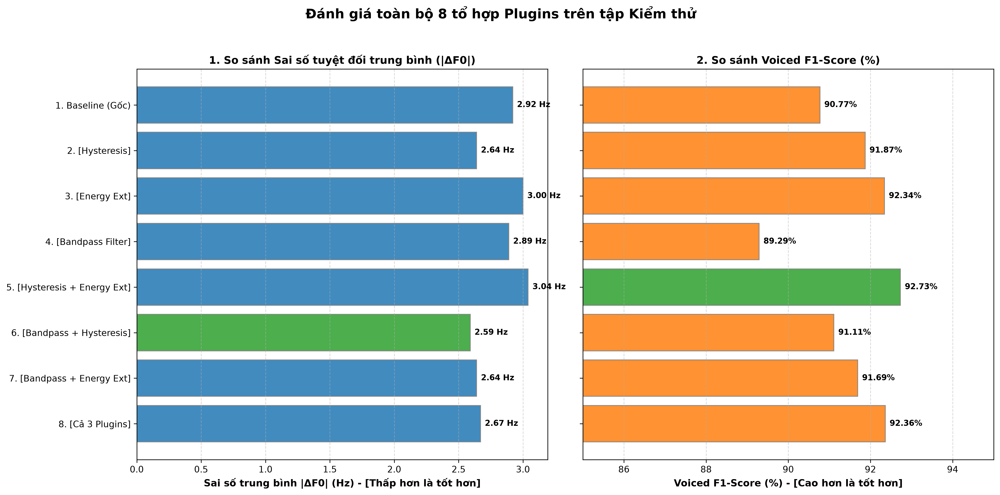

### Biểu đồ trực quan đối sánh Baseline vs Cấu hình tối ưu sai số (Cấu hình 29):

| `phone_F2.wav` | `phone_M2.wav` |
| :---: | :---: |
| 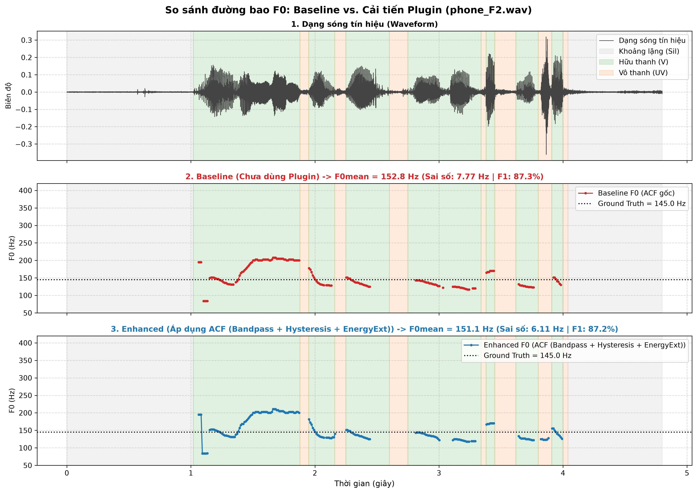 | 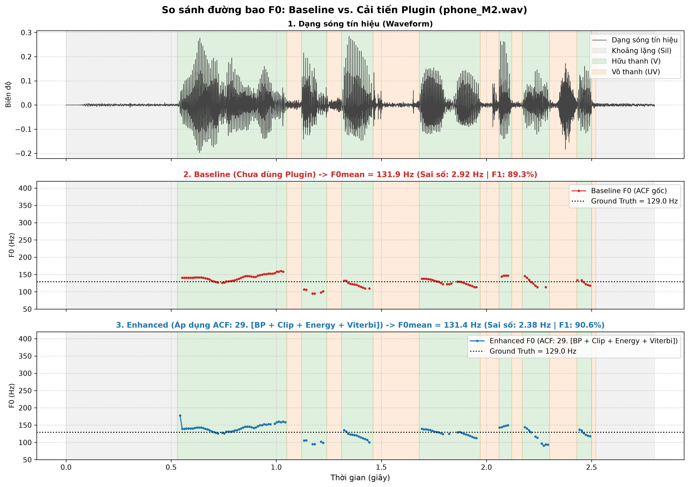 |
| **`studio_F2.wav`** | **`studio_M2.wav`** |
| 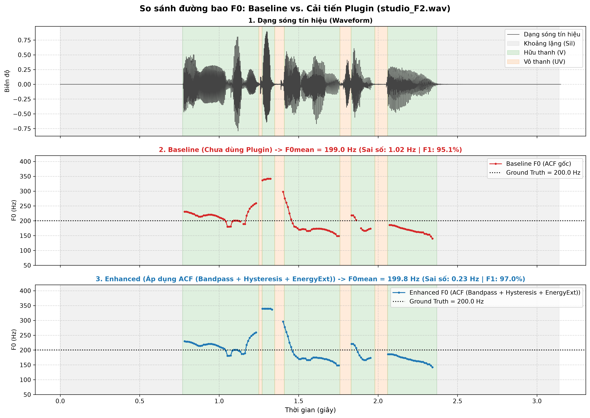 | 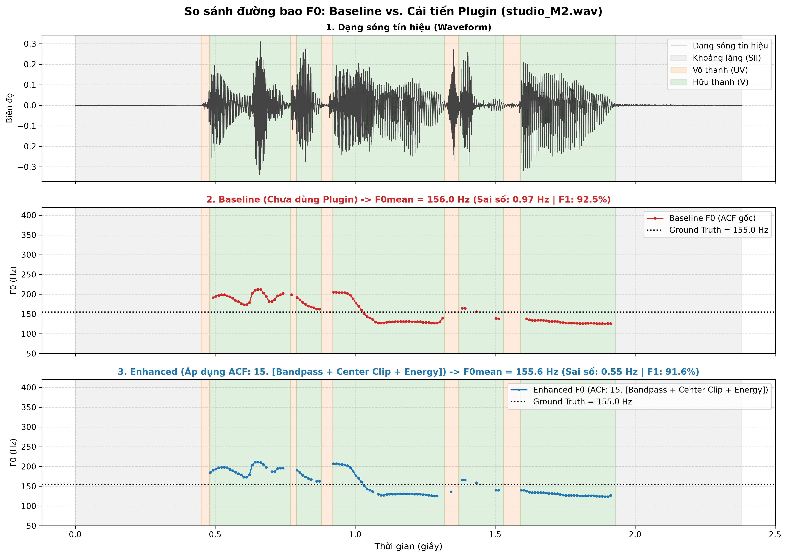 |

---

**Dẫn hướng:** [Trang chủ README](../README.md) | [Chương II: Thuật toán AMDF →](02_amdf_theory_and_experiments.md)
