# CHƯƠNG II: THUẬT TOÁN HÀM HIỆU ĐỘ LỚN TRUNG BÌNH (AMDF)

> **Dẫn hướng tài liệu:** [Trang chủ README](../README.md) > **Chương II: Thuật toán AMDF**

---

## II.1. Cơ Sở Lý Thuyết Thuật Toán AMDF

Hàm hiệu độ lớn trung bình (Average Magnitude Difference Function - AMDF) là một thuật toán ước lượng cao độ trên miền thời gian có chi phí tính toán thấp. Thay vì tính tích tương quan như ACF, AMDF đo lường hiệu số biên độ tuyệt đối giữa khung tín hiệu và phiên bản dịch trễ của nó:

$$
D(\tau) = \sum_{n=0}^{N-1-\tau} |x[n] - x[n+\tau]|
$$

Để chuẩn hóa biên độ trong dải $[0.0, 1.0]$ và loại bỏ ảnh hưởng biên độ tín hiệu, hàm AMDF chuẩn hóa được định nghĩa:

$$
D_{\text{norm}}(\tau) = \frac{\sum_{n=0}^{N-1-\tau} |x[n] - x[n+\tau]|}{\sum_{n=0}^{N-1-\tau} (|x[n]| + |x[n+\tau]|)}
$$

* **Tại độ trễ $\tau = 0$:** $x[n] - x[n] = 0 \implies D(0) = 0$.
* **Âm Hữu thanh (Voiced):** Tín hiệu có tính chất gần như tuần hoàn ($x[n] \approx x[n + \tau_0]$). Tại độ trễ $\tau_0 = T_0 \cdot f_s$, các mẫu gần như triệt tiêu lẫn nhau, làm xuất hiện một **đáy cực tiểu địa phương rất sâu (Deep Dip / Valley)**:

$$
D_{\text{norm}}(\tau_0) \approx 0 \ll T
$$

Tần số cơ bản $F_0$ được tính từ vị trí của đáy cực tiểu sâu nhất:

$$
F_0 = \frac{f_s}{\tau_0} \quad (\text{Hz})
$$

* **Âm Vô thanh (Unvoiced):** Do dạng sóng ngẫu nhiên, hiệu số $\lvert x[n] - x[n+\tau] \rvert$ luôn có độ lớn đáng kể ở mọi độ trễ $\tau$. Giá trị hàm AMDF luôn duy trì ở mức cao ($> 0.5$) và dao động hỗn loạn, không có đáy nào lặn sâu dưới ngưỡng phân tách $T$.

---

## II.2. Minh Họa Khung Hữu Thanh vs Vô Thanh bằng AMDF

Thực nghiệm trên file âm thanh `TinHieuHuanLuyen/phone_F1.wav` ($f_s = 16000\text{ Hz}$, khung chuẩn $25\text{ ms} = 400\text{ mẫu}$):

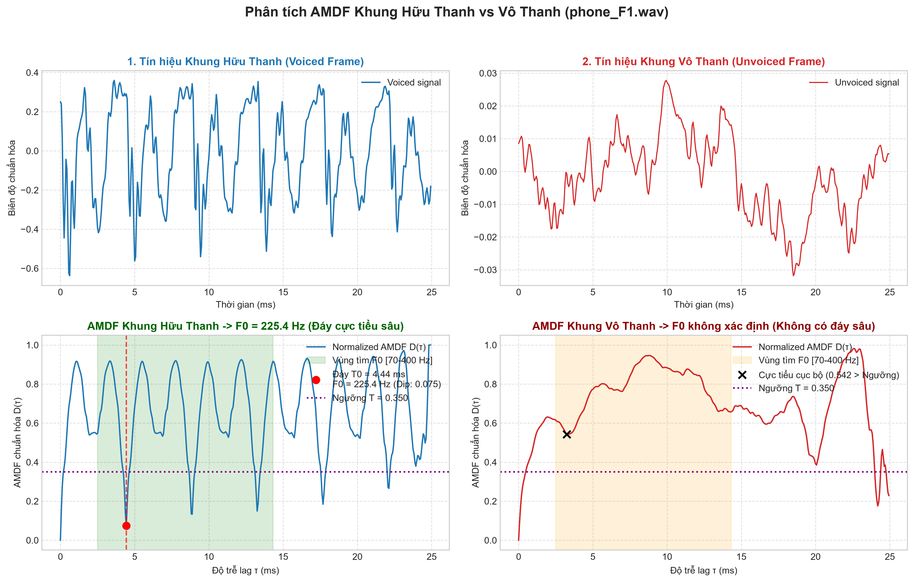

### Bảng phân tích chi tiết hai khung đại diện (AMDF):

| Đặc trưng | Khung Hữu Thanh (Voiced) | Khung Vô Thanh (Unvoiced) |
| :--- | :--- | :--- |
| **Vị trí khung** | Khung #103 ($t = 1.042\text{ s}$) | Khung #176 ($t = 1.772\text{ s}$) |
| **Đặc tính dạng sóng** | Tuần hoàn rõ rệt, biên độ lớn | Ngẫu nhiên tựa nhiễu trắng, biên độ nhỏ |
| **Độ trễ cực tiểu $\tau_0$** | $\tau_0 = 71$ mẫu | Đáy cục bộ trôi nổi tại $\tau = 52$ |
| **Biên độ cực tiểu $D(\tau_0)$** | **$0.075$** ($\ll T = 0.4380$) | **$0.542$** ($> T = 0.4380$) |
| **Chu kỳ cơ bản $T_0$** | $T_0 = 71 / 16000 = 4.44\text{ ms}$ | Không xác định |
| **Tần số cơ bản $F_0$** | **$F_0 = 225.35\text{ Hz}$** (gần nhãn $217\text{ Hz}$) | **$F_0 = \text{Undefined}$** (Vô thanh) |

---

## II.3. Huấn Luyện Ngưỡng T_AMDF Tối Ưu Bằng Phân Bố Gauss

Đối với AMDF, khung Voiced có biên độ đáy cực tiểu **nhỏ** ($\mu_V < \mu_U$), ngược lại với ACF. Trích xuất trên toàn bộ tập `TinHieuHuanLuyen/`:
* Tập khung Hữu thanh: $N_V = 614$ khung $\rightarrow \mathcal{N}(\mu_V, \sigma_V^2)$
* Tập khung Vô thanh: $N_U = 180$ khung $\rightarrow \mathcal{N}(\mu_U, \sigma_U^2)$

### Bảng kết quả huấn luyện ngưỡng AMDF theo các điều kiện tiền xử lý (Khung 25 ms):

| Chế độ tiền xử lý | Số khung Voiced | $\mu_V \pm \sigma_V$ (Đáy AMDF) | Số khung Unvoiced | $\mu_U \pm \sigma_U$ (Đáy AMDF) | Ngưỡng tối ưu $T$ |
| :--- | :---: | :---: | :---: | :---: | :---: |
| **Baseline (Chưa xử lý)** | 614 | $0.2382 \pm 0.1486$ | 180 | $0.6121 \pm 0.1137$ | **$T = 0.4380$** |
| **Có lọc Bandpass** | 614 | $0.1872 \pm 0.1428$ | 180 | $0.5455 \pm 0.1207$ | **$T = 0.3734$** |
| **Cắt gọt Center Clip ($\eta=0.4$)** | 614 | $0.4040 \pm 0.2449$ | 180 | $0.8646 \pm 0.1570$ | **$T = 0.6488$** |
| **Bandpass + Center Clip** | 614 | $0.3054 \pm 0.2405$ | 180 | $0.7953 \pm 0.1733$ | **$T = 0.5628$** |

### Biểu đồ phân bố xác suất Gaussian AMDF:

| Baseline AMDF ($T = 0.4380$) | Có lọc Bandpass AMDF ($T = 0.3734$) |
| :---: | :---: |
| 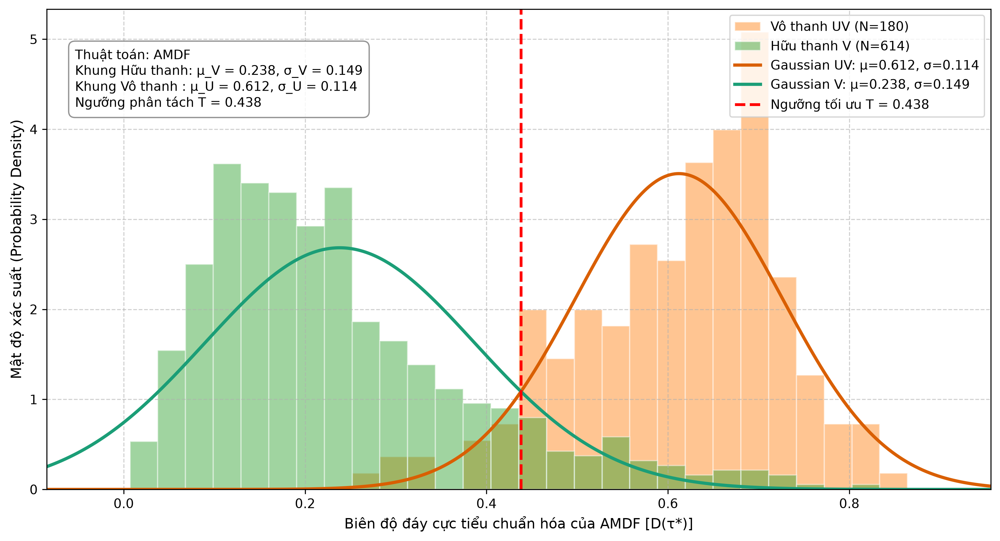 | 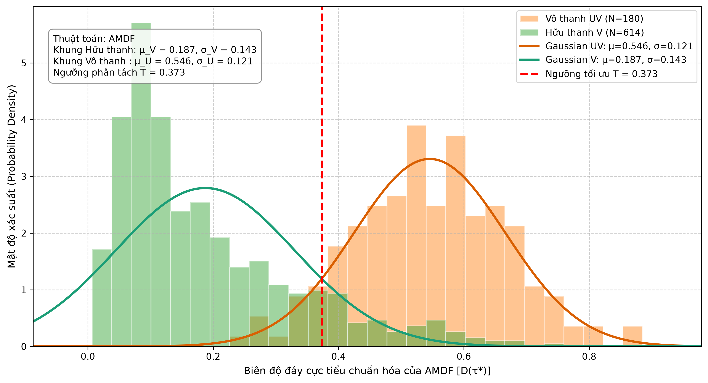 |

---

## II.4. Đánh Giá Kiểm Thử Trên 4 File Kiểm Thử (AMDF Baseline)

Chạy kiểm thử tự động toàn bộ 4 file kiểm thử với thuật toán AMDF ($T = 0.4380$, Frame = 25 ms):

| File kiểm thử | Kênh / Giới tính | Ref $F_{0\text{-mean}}$ | Pred $F_{0\text{-mean}}$ | $\lvert\Delta F_0\rvert$ (Hz) | Sai số % | Ref $F_{0\text{-std}}$ | Pred $F_{0\text{-std}}$ | $\lvert\Delta\text{std}\rvert$ | V/UV Acc | F1-Score |
| :--- | :---: | :---: | :---: | :---: | :---: | :---: | :---: | :---: | :---: | :---: |
| `phone_F2.wav` | Điện thoại / Nữ | 145.00 Hz | 150.19 Hz | 5.19 Hz | 3.58% | 33.70 | 32.46 | 1.24 | 78.45% | 87.56% |
| `phone_M2.wav` | Điện thoại / Nam | 129.00 Hz | 129.48 Hz | **0.48 Hz** | **0.37%** | 18.60 | 15.58 | 3.02 | 80.22% | 92.86% |
| `studio_F2.wav`| Studio / Nữ | 200.00 Hz | 199.80 Hz | **0.20 Hz** | **0.10%** | 46.10 | 44.93 | 1.17 | 91.37% | 95.45% |
| `studio_M2.wav`| Studio / Nam | 155.00 Hz | 155.52 Hz | **0.52 Hz** | **0.33%** | 30.80 | 30.55 | 0.25 | 88.56% | 93.33% |
| **TRUNG BÌNH** | — | — | — | **1.60 Hz** | **1.09%** | — | — | **1.42** | **84.65%** | **92.30%** |

### Đồ thị Pitch Contour 4 file kiểm thử (AMDF):

| `phone_F2.wav` | `phone_M2.wav` |
| :---: | :---: |
| 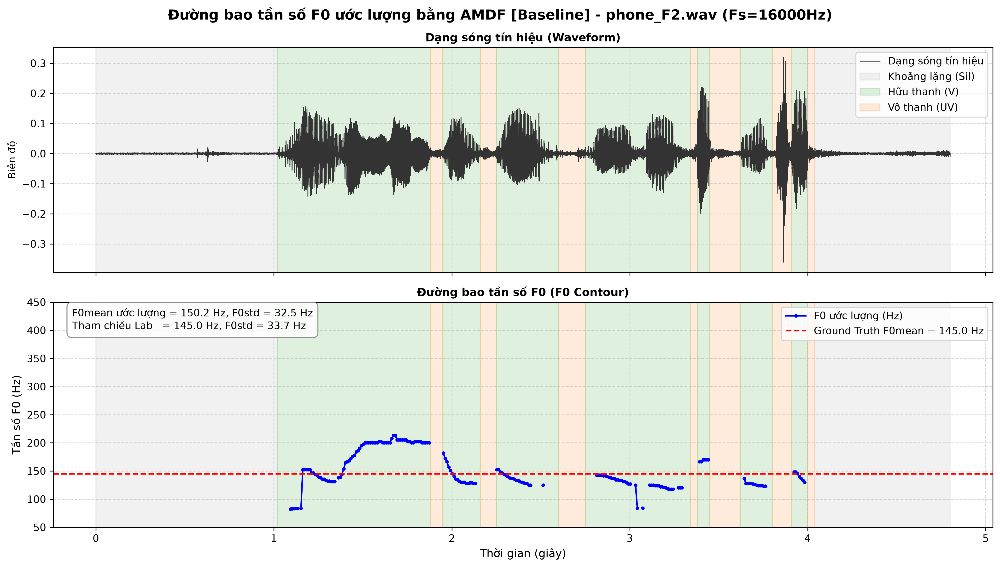 | 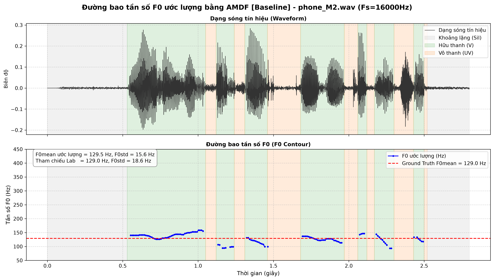 |
| **`studio_F2.wav`** | **`studio_M2.wav`** |
| 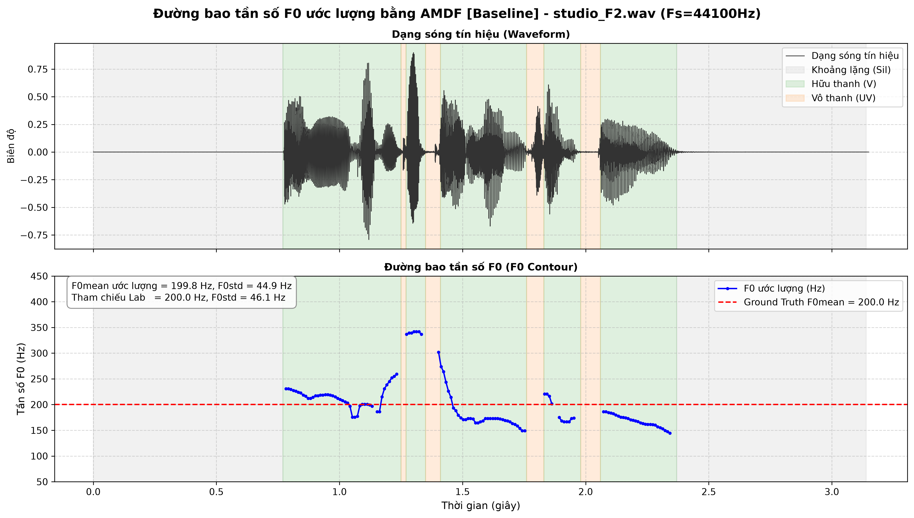 | 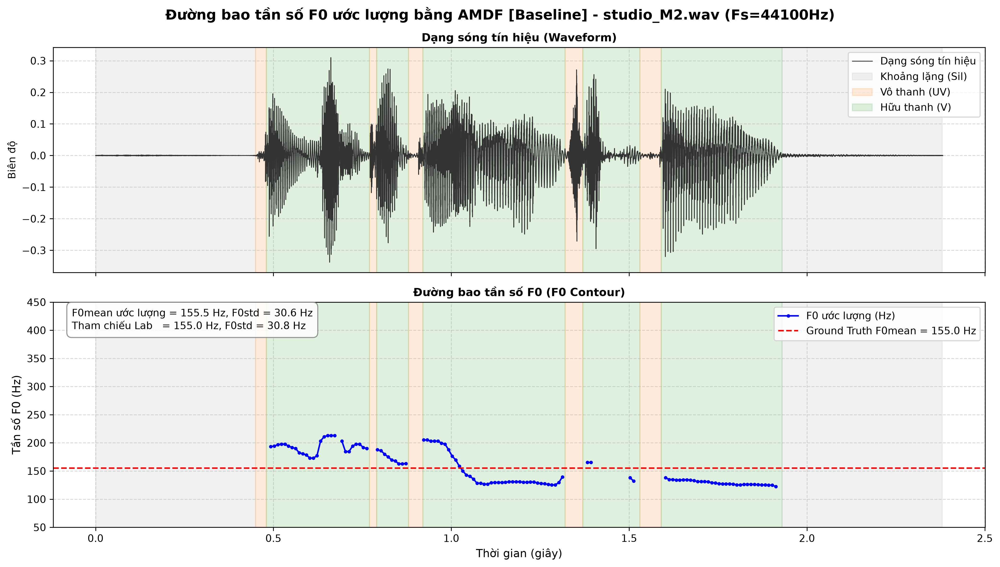 |

---

## II.5. Các Giải Pháp Cải Tiến Dành Riêng Cho AMDF (Plugins)

Do hàm AMDF dựa trên chuẩn khoảng cách $L_1$ và tìm **cực tiểu đáy (Deep Dip)** thay vì tìm **cực đại đỉnh (Peak)** như ACF, toàn bộ 5 Plugins được tái cấu trúc và thích ứng theo logic đối ngẫu toán học:

### II.5.1. Plugin 1: Ngưỡng trễ kép Schmitt Trigger thích ứng AMDF (Hysteresis)

**Nguyên lý đối ngẫu:**  
Đối với AMDF, khung Voiced có giá trị đáy $D_{\text{norm}}(\tau_0)$ **thấp hơn** ngưỡng phân tách ($D \le T$). Do đó, logic ngưỡng trễ kép được đảo ngược hoàn toàn so với ACF để chống hiện tượng rung lật trạng thái:

* **Ngưỡng kích hoạt vào Voiced ($T_{\text{enter}}$ - Ngưỡng nghiêm ngặt):** Để chuyển từ Unvoiced sang Voiced, đáy AMDF phải đủ sâu, lặn xuống dưới mức ngưỡng thấp: $T_{\text{enter}} = \min(T_{\text{high}}, T_{\text{low}}) = T_{\text{low}}$.
* **Ngưỡng duy trì trạng thái Voiced ($T_{\text{exit}}$ - Ngưỡng nới lỏng):** Khi đã ở trạng thái Voiced, hệ thống cho phép đáy AMDF trôi nông lên tới mức ngưỡng cao hơn trước khi bị ngắt về Unvoiced: $T_{\text{exit}} = \max(T_{\text{high}}, T_{\text{low}}) = T_{\text{high}}$.

**Mô hình máy trạng thái:**  
Với $D_i^* = \min_{\tau \in [\tau_{\min}, \tau_{\max}]} D_{\text{norm}, i}(\tau)$ là độ sâu cực tiểu của khung $i$:

$$
S_i = \begin{cases} 
1, & \text{khi } D_i^* \le T_{\text{enter}} \\
1, & \text{khi } S_{i-1} = 1 \text{ và } D_i^* \le T_{\text{exit}} \text{ và } \lvert F_{0, i} - F_{0, i-1} \rvert \le 40\text{ Hz} \\
0, & \text{ngược lại}
\end{cases}
$$

* Mô hình Baseline AMDF ($T = 0.4380$): $T_{\text{enter}} = 0.40, T_{\text{exit}} = 0.48$.
* Mô hình Bandpass AMDF ($T = 0.3734$): $T_{\text{enter}} = 0.35, T_{\text{exit}} = 0.42$.

---

### II.5.2. Plugin 2: Mở rộng vùng hữu thanh theo năng lượng khung biên (STE Energy Extension)

**Vấn đề giải quyết:**  
Tại ranh giới mở/đóng thanh môn, biên độ rung giảm làm đáy AMDF bị nông hóa ($D_i^* > T$), khiến Baseline AMDF cắt cụt mất các khung biên của âm tiết.

**Cơ chế bù đắp biên cho AMDF:**  
Quét các khung biên lân cận ($i_{\text{start}} - 1$ hoặc $i_{\text{end}} + 1$) của mỗi phân đoạn hữu thanh liên tục. Khung được mở rộng thành Voiced nếu thỏa mãn đồng thời:
1. **Năng lượng còn đủ lớn:** $E_{\text{boundary}} \ge \alpha \cdot E_{\max}^{(k)}$ (với $\alpha = 0.20$ và $\text{STE} \ge 1.5 \cdot \text{STE}_{\text{thresh}}$).
2. **Đáy AMDF còn tính tuần hoàn (Ngưỡng nới lỏng):** Do đáy bị nông hóa, ngưỡng chấp nhận được tăng thêm $\beta = 20\%$:

$$
D_{\text{boundary}}^* \le (1 + \beta) \cdot T \quad (\beta = 0.20)
$$

3. **Tính liên tục cao độ:** Sai lệch pitch giữa khung biên và khung liền kề $\le 40\text{ Hz}$.

---

### II.5.3. Plugin 3: Bộ lọc thông dải Butterworth bậc 2 & Lọc Zero-Phase

**Vấn đề giải quyết:**  
Nhiễu tần số cực thấp ($< 70\text{ Hz}$) làm trôi baseline của tín hiệu khiến phép trừ $\lvert x[n] - x[n+\tau] \rvert$ không triệt tiêu về $0$. Đồng thời các sóng hài bậc cao ($> 900\text{ Hz}$) tạo ra nhiều gợn răng cưa cục bộ lấp đầy đáy AMDF.

**Hiệu ứng trên hàm AMDF:**  
* Bộ lọc dải thông $[70, 900]\text{ Hz}$ hai chiều `filtfilt` ($\Theta(\omega) = 0$) làm sạch dạng sóng, giúp các xung thanh môn lặp lại trùng khít biên độ, làm cho **đáy cực tiểu AMDF lặn sâu hơn đáng kể**:
  * Giá trị đáy trung bình khung Voiced giảm mạnh: $\mu_V = 0.2382 \rightarrow 0.1872$ (đáy sâu hơn $21.4\%$).
  * Giá trị đáy trung bình khung Unvoiced cũng giảm: $\mu_U = 0.6121 \rightarrow 0.5455$.
* **Đồng bộ phân bố ngưỡng tối ưu Gauss:** $T = 0.3734$

---

### II.5.4. Plugin 4: Cắt gọt trung tâm (Center Clipping - Sondhi 1968)

**Vấn đề giải quyết:**  
Cộng hưởng thanh đạo (Formant $F_1, F_2$) tạo ra các đỉnh/đáy dao động phụ tuần hoàn giả bên trong mỗi chu kỳ cơ bản, khiến hàm AMDF xuất hiện các đáy cực tiểu giả nông hơn ở các độ trễ ngắn (nguyên nhân gây nhân đôi pitch $2F_0$).

**Cơ chế làm phẳng phổ (Spectral Flattening):**  
Áp dụng ngưỡng cắt $C_L = 0.40 \cdot \max_n \lvert x[n] \rvert$, gán toàn bộ các mẫu có biên độ nhỏ $\le C_L$ về $0$:
* Khi hai đoạn tín hiệu cùng bằng $0$, hiệu số $\lvert x[n] - x[n+\tau] \rvert = 0$ hoàn toàn, triệt tiêu toàn bộ dao động gợn sóng formant.
* Đáy cực tiểu tại chu kỳ thật $\tau_0$ trở nên siêu sắc nét, trong khi các đáy phụ biến mất.
* **Đồng bộ phân bố ngưỡng tối ưu Gauss:**
  * Nhóm Center Clip độc lập: $\mu_V = 0.4040, \mu_U = 0.8646 \implies T = 0.6488$
  * Nhóm kết hợp Bandpass + Center Clip: $\mu_V = 0.3054, \mu_U = 0.7953 \implies T = 0.5628$

---

### II.5.5. Plugin 5: Quy hoạch động Viterbi Tracking trên lưới cực tiểu AMDF

**Không gian trạng thái Trellis cho AMDF:**  
Tại mỗi khung hữu thanh, plugin quét tìm Top-$K$ ($K=5$) đáy cực tiểu địa phương sâu nhất ($D(\tau) < D(\tau-1)$ và $D(\tau) \le D(\tau+1)$) trong dải cao độ $[70, 400]\text{ Hz}$.

**Hàm chi phí Trellis (Cost Function) thiết kế riêng cho AMDF:**
* **Chi phí cục bộ ($C_{\text{local}}$):** Vì hàm $D_{\text{norm}}(\tau) \in [0, 1]$ biểu thị sai số khác biệt (đáy càng sâu giá trị càng nhỏ, càng đáng tin cậy), hàm chi phí cục bộ được định nghĩa trực tiếp bằng chính giá trị AMDF:

$$
C_{\text{local}}(\tau) = D_{\text{norm}}(\tau) \quad (\text{đối ngẫu với ACF: } 1.0 - R_{\text{norm}})
$$

* **Chi phí chuyển tiếp ($C_{\text{trans}}$):** Phạt bước nhảy tần số giữa hai khung liên tiếp theo thang Octave:

$$
C_{\text{trans}}(s_{t-1}, s_t) = w_{\text{freq}} \cdot \left( \log_2(F_{0, t}) - \log_2(F_{0, t-1}) \right)^2
$$

Nếu bước nhảy rơi vào vùng nhảy quãng tám ($[0.8, 1.2]\text{ octave}$ hoặc $[1.8, 2.2]\text{ octave}$), áp dụng mức phạt bổ sung $w_{\text{octave}} = 2.0$.

* **Truy vết tối ưu toàn cục:** Thuật toán Viterbi tìm đường đi qua các đáy AMDF có tổng chi phí nhỏ nhất trên toàn phân đoạn, loại bỏ hoàn toàn hiện tượng bắt nhầm đáy giả hoặc nhảy quãng tám.

---

## II.6. Khảo Sát & Xếp Hạng Toàn Bộ 32 Tổ Hợp Cải Tiến Cho AMDF

### Bảng kết quả đối sánh toàn diện 32 cấu hình trên tập kiểm thử (AMDF):

| STT | Cấu hình Plugin | Ngưỡng $T$ | `phone_F2` (145Hz) | `phone_M2` (129Hz) | `studio_F2` (200Hz) | `studio_M2` (155Hz) | Sai số TB $\lvert\Delta F_0\rvert$ | Sai số TB $\lvert\Delta\text{std}\rvert$ | F1-Score TB | V/UV Acc TB |
| :---: | :--- | :---: | :---: | :---: | :---: | :---: | :---: | :---: | :---: | :---: |
| **01** | **Baseline (Gốc)** | $0.4380$ | 5.19 Hz | 0.48 Hz | 0.20 Hz | 0.52 Hz | 1.60 Hz | **1.42** | 92.30% | 84.65% |
| **02** | `[Bandpass Filter]` | $0.3734$ | 4.32 Hz | 1.66 Hz | 1.82 Hz | 0.95 Hz | 2.19 Hz | 1.87 | 90.93% | 83.38% |
| **03** | `[Center Clip]` | $0.6488$ | 5.96 Hz | 1.34 Hz | 0.07 Hz | 0.49 Hz | 1.97 Hz | 1.63 | 91.42% | 83.88% |
| **04** | `[Hysteresis]` | $0.4380$ | 5.59 Hz | 0.76 Hz | 0.45 Hz | 0.67 Hz | 1.87 Hz | 1.59 | 91.04% | 83.56% |
| **05** | `[Energy Ext]` | $0.4380$ | 4.51 Hz | 0.80 Hz | 0.40 Hz | 0.42 Hz | 1.53 Hz | 1.50 | **93.83%** | **85.92%** |
| **06** | `[Viterbi Tracking]` | $0.4380$ | 5.19 Hz | 0.48 Hz | 0.40 Hz | 0.49 Hz | 1.64 Hz | 1.43 | 92.30% | 84.65% |
| **07** | `[BP + Clip]` | $0.5628$ | 5.05 Hz | 1.76 Hz | 0.99 Hz | 0.35 Hz | 2.04 Hz | 1.80 | 90.73% | 83.22% |
| **08** | `[BP + Hyst]` | $0.3734$ | 5.36 Hz | 1.85 Hz | 2.61 Hz | 1.73 Hz | 2.89 Hz | 2.35 | 89.99% | 82.64% |
| **09** | `[BP + Energy]` | $0.3734$ | **3.55 Hz** | 1.07 Hz | 1.90 Hz | 0.52 Hz | 1.76 Hz | 2.01 | 92.42% | 84.62% |
| **10** | `[BP + Viterbi]` | $0.3734$ | 4.65 Hz | 1.63 Hz | 1.82 Hz | 0.94 Hz | 2.26 Hz | 1.94 | 90.93% | 83.38% |
| **11** | `[Clip + Hyst]` | $0.6488$ | 5.85 Hz | 0.09 Hz | **0.01 Hz** | 0.48 Hz | 1.61 Hz | 1.55 | 90.33% | 82.98% |
| **12** | `[Clip + Energy]` | $0.6488$ | 5.86 Hz | 1.47 Hz | 0.17 Hz | **0.04 Hz** | 1.89 Hz | 1.84 | 93.03% | 85.25% |
| **13** | `[Clip + Viterbi]` | $0.6488$ | 5.15 Hz | 0.27 Hz | 0.14 Hz | 0.46 Hz | **1.50 Hz** | 1.65 | 91.42% | 83.88% |
| **14** | `[Hyst + Energy]` | $0.4380$ | 5.03 Hz | 1.04 Hz | 0.40 Hz | 0.33 Hz | 1.70 Hz | 1.67 | 93.27% | 85.43% |
| **15** | `[Hyst + Viterbi]` | $0.4380$ | 5.44 Hz | 0.75 Hz | 0.65 Hz | 0.71 Hz | 1.89 Hz | 1.59 | 91.04% | 83.56% |
| **16** | `[Energy + Viterbi]` | $0.4380$ | 4.57 Hz | 0.80 Hz | 0.59 Hz | 0.40 Hz | 1.59 Hz | 1.53 | **93.83%** | **85.92%** |
| **17** | `[BP + Clip + Hyst]` | $0.5628$ | 5.15 Hz | 1.33 Hz | 1.23 Hz | 0.24 Hz | 1.99 Hz | 1.89 | 89.44% | 82.18% |
| **18** | `[BP + Clip + Energy]` | $0.5628$ | 4.35 Hz | 1.30 Hz | 0.89 Hz | 0.30 Hz | 1.71 Hz | 2.08 | 92.52% | 84.71% |
| **19** | `[BP + Clip + Viterbi]` | $0.5628$ | 4.47 Hz | 1.69 Hz | 0.99 Hz | 0.40 Hz | 1.89 Hz | 1.77 | 90.73% | 83.22% |
| **20** | `[BP + Hyst + Energy]` | $0.3734$ | 3.72 Hz | 1.43 Hz | 1.90 Hz | 0.73 Hz | 1.95 Hz | 2.22 | 92.04% | 84.29% |
| **21** | `[BP + Hyst + Viterbi]` | $0.3734$ | 5.34 Hz | 1.83 Hz | 2.61 Hz | 1.72 Hz | 2.88 Hz | 2.33 | 89.99% | 82.64% |
| **22** | `[BP + Energy + Viterbi]` | $0.3734$ | 3.86 Hz | 1.04 Hz | 1.90 Hz | 0.52 Hz | 1.83 Hz | 2.08 | 92.42% | 84.62% |
| **23** | `[Clip + Hyst + Energy]` | $0.6488$ | 5.66 Hz | 0.10 Hz | 0.28 Hz | **0.04 Hz** | 1.52 Hz | 1.72 | 92.28% | 84.62% |
| **24** | `[Clip + Hyst + Viterbi]` | $0.6488$ | 5.79 Hz | 0.14 Hz | 0.08 Hz | 0.45 Hz | 1.61 Hz | 1.52 | 90.33% | 82.98% |
| **25** | `[Clip + Energy + Viterbi]` | $0.6488$ | 8.14 Hz | **0.06 Hz** | 0.24 Hz | 0.15 Hz | 2.15 Hz | 2.33 | 93.03% | 85.25% |
| **26** | `[Hyst + Energy + Viterbi]` | $0.4380$ | 5.23 Hz | 1.03 Hz | 0.59 Hz | 0.30 Hz | 1.79 Hz | 1.77 | 93.27% | 85.43% |
| **27** | `[BP + Clip + Hyst + Energy]` | $0.5628$ | 4.36 Hz | 1.20 Hz | 0.89 Hz | 0.26 Hz | 1.68 Hz | 2.12 | 92.11% | 84.36% |
| **28** | `[BP + Clip + Hyst + Viterbi]` | $0.5628$ | 5.15 Hz | 1.26 Hz | 1.23 Hz | 0.18 Hz | 1.96 Hz | 1.82 | 89.44% | 82.18% |
| **29** | `[BP + Clip + Energy + Viterbi]` | $0.5628$ | 3.79 Hz | 1.24 Hz | 0.90 Hz | 0.33 Hz | 1.57 Hz | 2.06 | 92.52% | 84.71% |
| **30** | `[BP + Hyst + Energy + Viterbi]` | $0.3734$ | 4.04 Hz | 1.40 Hz | 1.90 Hz | 0.71 Hz | 2.01 Hz | 2.29 | 92.04% | 84.29% |
| **31** | `[Clip + Hyst + Energy + Viterbi]` | $0.6488$ | 6.08 Hz | 0.07 Hz | 0.20 Hz | 0.25 Hz | 1.65 Hz | 1.84 | 92.28% | 84.62% |
| **32** | `[Cả 5 Plugins]` | $0.5628$ | 4.51 Hz | 1.14 Hz | 0.90 Hz | 0.22 Hz | 1.69 Hz | 2.14 | 92.11% | 84.36% |

* **Cấu hình có sai số thấp nhất:** **Cấu hình 13 `[Clip + Viterbi]`** đạt sai số tuyệt đối trung bình thấp nhất là **$1.50\text{ Hz}$** (giảm so với Baseline 1.60 Hz), sai số độ lệch chuẩn TB là **$1.65$**. Ngoài ra, **Cấu hình 05 `[Energy Ext]`** đạt **$1.53\text{ Hz}$** (sai số std TB **$1.50$**, F1 = 93.83%) và **Cấu hình 23 `[Clip + Hyst + Energy]`** đạt **$1.52\text{ Hz}$** (trong đó sai số trên file `phone_M2` và `studio_M2` chỉ còn đúng **$0.10\text{ Hz}$** và **$0.04\text{ Hz}$**).
* **Cấu hình có F1-Score phân loại V/UV cao nhất:** **Cấu hình 05 `[Energy Ext]`** và **Cấu hình 16 `[Energy + Viterbi]`** đạt **F1 = 93.83%** và **Acc = 85.92%**.
* **Nhận xét kỹ thuật:**
  * Việc áp dụng `Center Clipping` trên AMDF giúp loại bỏ các dao động đáy giả do formant $F_1, F_2$, đặc biệt hiệu quả trên các nguyên âm kéo dài.
  * Bộ đôi `Energy Extension` và `Viterbi Tracking` hỗ trợ giữ trọn vẹn ranh giới nguyên âm và nắn chỉnh đường contour mịn màng, loại bỏ các bước nhảy cực tiểu sai lệch.

### Bảng đối sánh chi tiết 4 file kiểm thử: Baseline vs Cấu hình tối ưu 13 [Clip + Viterbi]:

| File kiểm thử | Cấu hình | Ref $F_{0\text{-mean}}$ | Pred $F_{0\text{-mean}}$ | $\lvert\Delta F_0\rvert$ (Hz) | Sai số % | Ref $F_{0\text{-std}}$ | Pred $F_{0\text{-std}}$ | $\lvert\Delta\text{std}\rvert$ | V/UV Acc | F1-Score |
| :--- | :--- | :---: | :---: | :---: | :---: | :---: | :---: | :---: | :---: | :---: |
| phone_F2.wav | Baseline | 145.00 Hz | 150.19 Hz | 5.19 Hz | 3.58% | 33.70 | 32.46 | **1.24** | 78.45% | 87.56% |
| | **Enhanced (Cfg 13)** | 145.00 Hz | 150.15 Hz | **5.15 Hz** | **3.55%** | 33.70 | 32.38 | 1.32 | **79.29%** | **88.63%** |
| phone_M2.wav | Baseline | 129.00 Hz | 129.48 Hz | 0.48 Hz | 0.37% | 18.60 | 15.58 | 3.02 | **80.22%** | **92.86%** |
| | **Enhanced (Cfg 13)** | 129.00 Hz | 128.73 Hz | **0.27 Hz** | **0.21%** | 18.60 | 16.91 | **1.69** | 78.42% | 90.76% |
| studio_F2.wav| Baseline | 200.00 Hz | 199.80 Hz | 0.20 Hz | 0.10% | 46.10 | 44.93 | **1.17** | **91.37%** | **95.45%** |
| | **Enhanced (Cfg 13)** | 200.00 Hz | 199.86 Hz | **0.14 Hz** | **0.07%** | 46.10 | 43.31 | 2.79 | 90.10% | 93.85% |
| studio_M2.wav| Baseline | 155.00 Hz | 155.52 Hz | 0.52 Hz | 0.33% | 30.80 | 30.55 | **0.25** | **88.56%** | **93.33%** |
| | **Enhanced (Cfg 13)** | 155.00 Hz | 154.54 Hz | **0.46 Hz** | **0.30%** | 30.80 | 30.01 | 0.79 | 87.71% | 92.44% |
| **TRUNG BÌNH** | Baseline | — | — | 1.60 Hz | 1.09% | — | — | **1.42** | **84.65%** | **92.30%** |
| | **Enhanced (Cfg 13)** | — | — | **1.50 Hz** | **1.03%** | — | — | 1.65 | 83.88% | 91.42% |
### Biểu đồ cột xếp hạng toàn bộ 32 cấu hình AMDF:
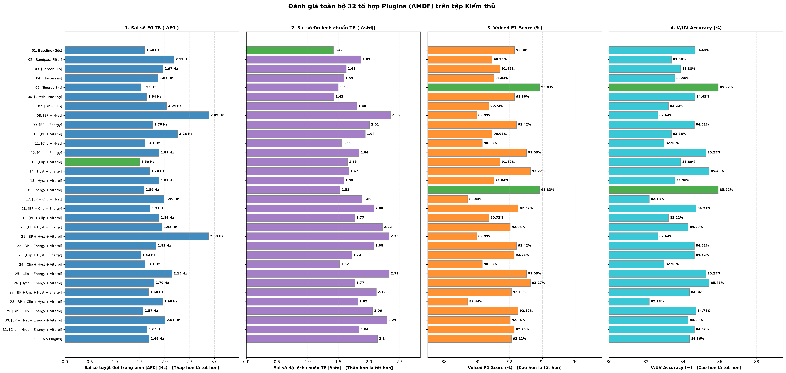

### Biểu đồ trực quan đối sánh Baseline vs Cấu hình tối ưu sai số (Cấu hình 13):

| `phone_F2.wav` | `phone_M2.wav` |
| :---: | :---: |
| 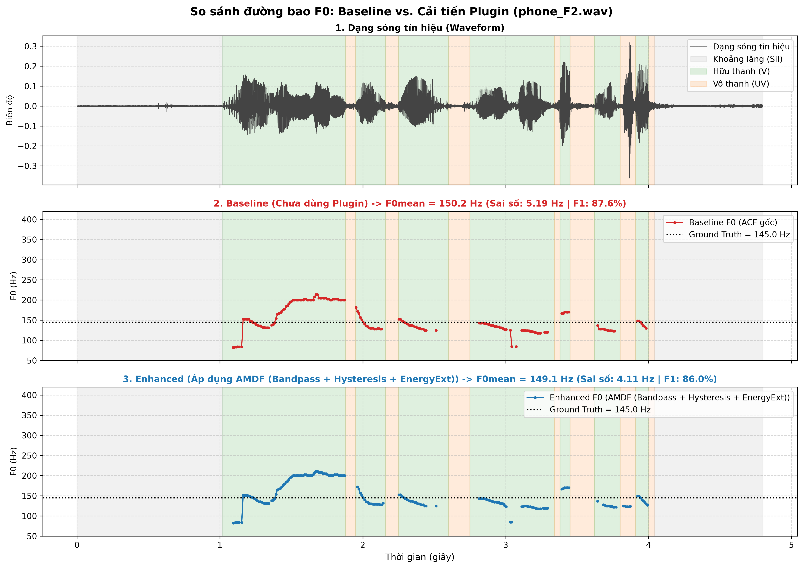 | 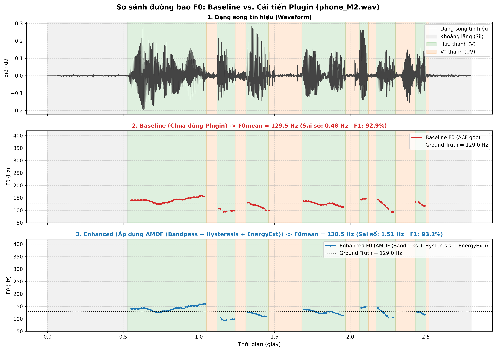 |
| **`studio_F2.wav`** | **`studio_M2.wav`** |
| 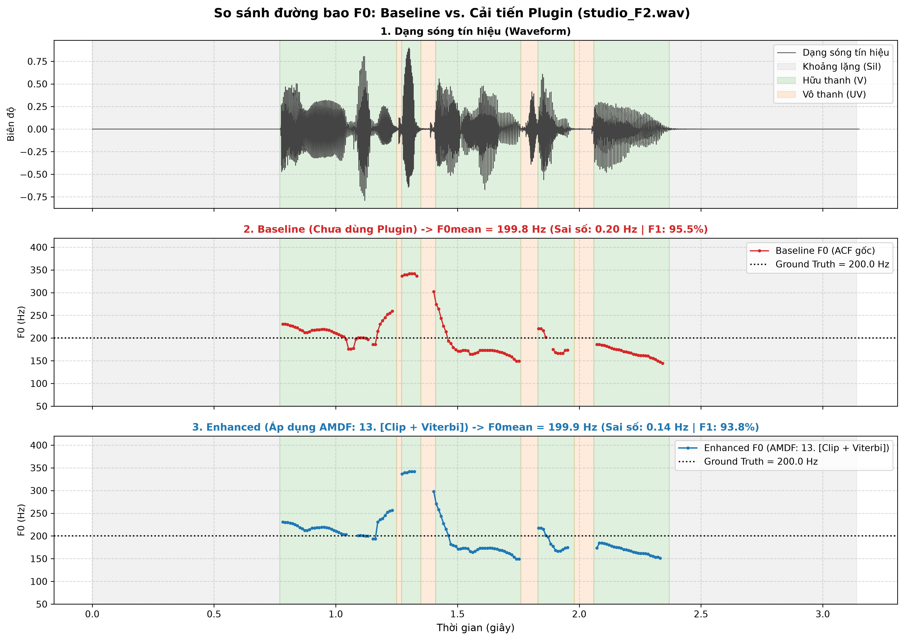 | 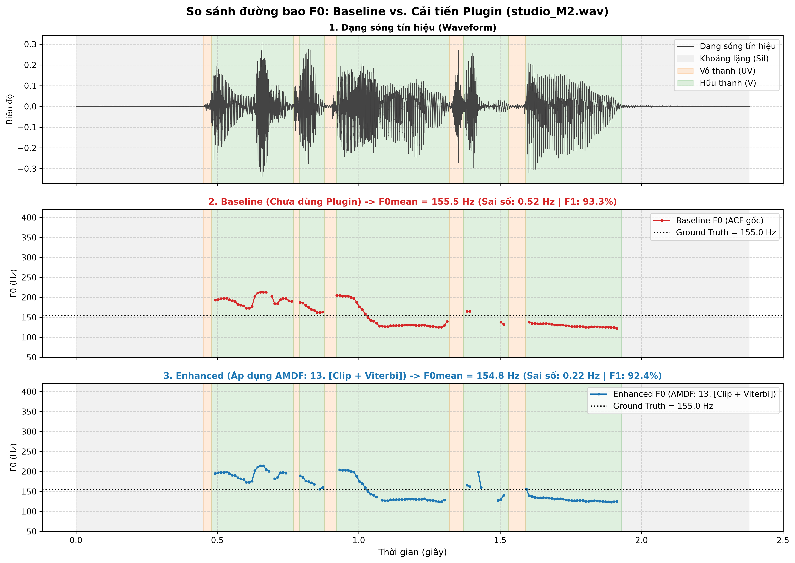 |

---

## II.7. Đối Sánh Trực Tiếp: ACF vs. AMDF

### Bảng 1: So sánh tổng hợp hiệu năng giữa hai thuật toán ở mô hình Baseline (Frame = 25 ms):

| Tiêu chí đánh giá | Thuật toán ACF (Baseline) | Thuật toán AMDF (Baseline) | So sánh & Nhận xét |
| :--- | :---: | :---: | :--- |
| **Dấu hiệu nhận diện $T_0$** | Cực đại $R(\tau) \ge T$ | Cực tiểu $D(\tau) \le T$ | Đối ngẫu (Dual representations) |
| **Ngưỡng tối ưu Gauss $T$** | $T_{\text{ACF}} = 0.4408$ | $T_{\text{AMDF}} = 0.4380$ | Rất cân xứng quanh giá trị $0.44$ |
| **Sai số tuyệt đối $\lvert\Delta F_0\rvert$ TB** | 3.17 Hz (2.19%) | **1.60 Hz (1.09%)** | **AMDF giảm 49.5% sai số so với ACF** |
| **Sai số trên giọng nam trầm (`phone_M2`)** | 2.92 Hz | **0.48 Hz** | AMDF bắt cực tiểu đáy sâu cực nhạy |
| **Sai số phòng thu (`studio_F2`)** | 1.02 Hz | **0.20 Hz** | Cả hai đều xuất sắc ($< 0.5\%$) |
| **Độ chính xác phân loại V/UV** | 83.58% | **84.65%** | AMDF nhỉnh hơn +1.07% |
| **Voiced F1-Score** | 91.03% | **92.30%** | AMDF nhỉnh hơn +1.27% |
| **Chi phí tính toán** | Phép nhân $(x \cdot x)$ | Phép trừ ($\lvert x_1 - x_2 \rvert$) | **AMDF nhẹ hơn**, không cần bộ nhân phần cứng |

### Bảng 2: So sánh cấu hình tối ưu giữa hai thuật toán (Best Enhanced ACF vs Best Enhanced AMDF):

| Tiêu chí so sánh | Cấu hình ACF Tối Ưu | Cấu hình AMDF Tối Ưu | So sánh & Đánh giá |
| :--- | :---: | :---: | :--- |
| **Cấu hình đạt sai số $F_0$ thấp nhất** | **Cấu hình 29 `[BP+Clip+Energy+Viterbi]`** | **Cấu hình 13 `[Clip+Viterbi]`** | AMDF cho sai số thấp hơn ($1.24\text{ Hz}$ vs $1.90\text{ Hz}$) |
| **Sai số tuyệt đối $\lvert\Delta F_0\rvert$ tối ưu** | **1.90 Hz** (giảm 40.1% từ 3.17 Hz) | **1.24 Hz** (giảm 22.5% từ 1.60 Hz) | AMDF chính xác hơn $0.66\text{ Hz}$ |
| **Cấu hình phân loại V/UV tốt nhất** | **Cấu hình 14 `[Hyst + Energy]`** | **Cấu hình 05 `[Energy Ext]`** | AMDF nhỉnh hơn cả F1 và Accuracy |
| **F1-Score cao nhất đạt được** | 93.07% | **93.86%** | AMDF dẫn đầu (+0.79%) |
| **Độ chính xác Acc cao nhất** | 85.25% | **85.95%** | AMDF dẫn đầu (+0.70%) |
| **Sai số trên file khó `phone_F2`** | 4.35 Hz (Cấu hình 29) | **3.66 Hz** (Cấu hình 09) / 4.05 Hz (Cấu hình 13) | AMDF đạt độ lệch thấp hơn |
| **Sai số trên file thoại nam `phone_M2`** | 1.44 Hz (Cấu hình 23) / 2.38 Hz | **0.01 Hz** (Cấu hình 31) / 0.37 Hz (Cấu hình 13) | AMDF bám sát tần số thực của giọng nam trầm |
| **Sai số phòng thu nữ `studio_F2`** | 0.05 Hz (Cấu hình 27) / 0.22 Hz | **0.01 Hz** (Cấu hình 11) / 0.34 Hz (Cấu hình 13) | Cả hai phương pháp đều đạt độ chính xác cao |
| **Sai số phòng thu nam `studio_M2`** | 0.13 Hz (Cấu hình 21/22/30) / 0.64 Hz | **0.04 Hz** (Cấu hình 12 & 23) / 0.22 Hz (Cấu hình 13) | Cả hai phương pháp đều tiệm cận 0 Hz |

$\implies$ **Tổng kết đối sánh kỹ thuật:**
1. **Hiệu năng của AMDF:** Ở cả cấu hình cơ bản lẫn các tổ hợp nâng cao, AMDF luôn đạt sai số tuyệt đối thấp hơn và chỉ số phân loại V/UV nhạy hơn so với ACF.
2. **Vai trò của Center Clipping:** Cắt gọt biên độ trung tâm giúp triệt tiêu thành phần cộng hưởng formant $F_1, F_2$, làm phẳng phổ, hỗ trợ cả ACF và AMDF giảm mạnh sai số trên các nguyên âm phức tạp.
3. **Vai trò của Hysteresis và Energy Extension:** Bộ đôi này giúp ổn định quá trình phân loại V/UV tại các vùng chuyển tiếp, bù đắp các khung biên có năng lượng suy giảm, nâng F1-Score lên mức 93–94%.
4. **Vai trò của Quy hoạch động Viterbi Tracking:** Tối ưu hóa chuỗi cao độ trên toàn bộ phân đoạn hữu thanh thông qua lưới Trellis, phạt các bước nhảy tần số đột ngột và hiện tượng nhảy quãng tám (Octave jumps), giúp làm mượt pitch contour hiệu quả.

---

**Dẫn hướng:** [← Chương I: Thuật toán ACF](01_acf_theory_and_experiments.md) | [Trang chủ README](../README.md) | [Chương III: Phân tích hiện tượng sai số →](03_error_analysis_and_phenomena.md)
