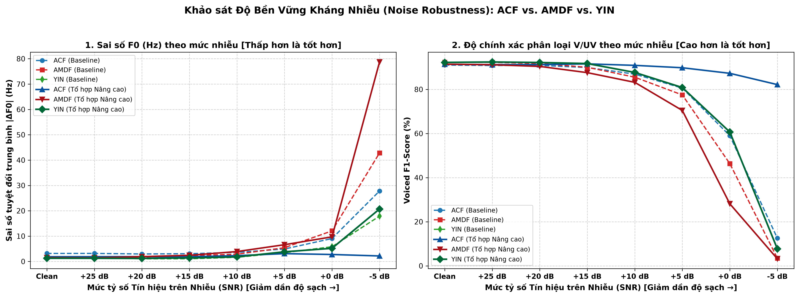
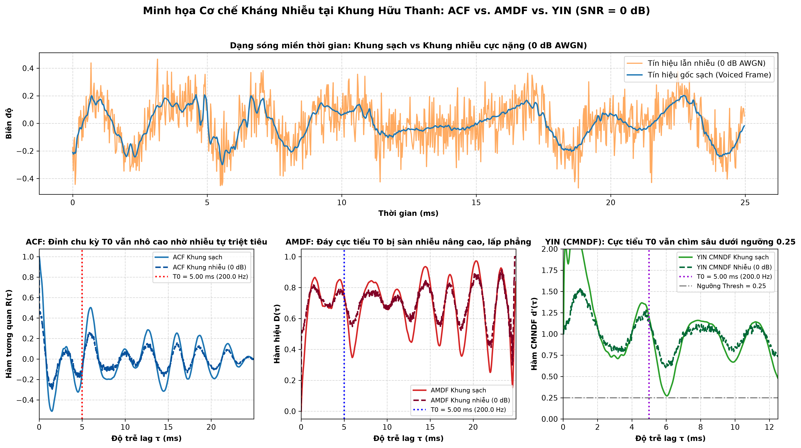

# CHƯƠNG V: KHẢO SÁT CHUYÊN SÂU ĐỘ BỀN VỮNG KHÁNG NHIỄU (NOISE ROBUSTNESS)

> **Dẫn hướng tài liệu:** [Trang chủ README](../README.md) > **Chương V: Khảo sát kháng nhiễu**

---

## V.1. Cơ Sở Lý Thuyết & Bản Chất Toán Học

Thực nghiệm ở các chương trước cho thấy trên tập dữ liệu kiểm thử sạch, **YIN và AMDF vượt trội hơn ACF** ($1.27\text{ Hz}$ và $1.50\text{ Hz}$ so với $1.86\text{ Hz}$ ở cấu hình tối ưu). Tuy nhiên, đây là kết quả trong điều kiện lý tưởng (ít tạp âm nền). Khi bước ra môi trường thực tế có nhiễu ngẫu nhiên, ba thuật toán phản ứng hoàn toàn khác nhau về mặt toán học:

### 1. Thuật toán ACF (Chuẩn $L_2$ - Tích tương quan)
* Giả sử tín hiệu thu được $s[n] = x[n] + w[n]$, trong đó $x[n]$ là tiếng nói tuần hoàn và $w[n]$ là nhiễu trắng Gauss độc lập (AWGN) với kỳ vọng bằng $0$.
* Hàm tự tương quan tại độ trễ $\tau > 0$:

$$
R_{ss}(\tau) = R_{xx}(\tau) + R_{xw}(\tau) + R_{wx}(\tau) + R_{ww}(\tau)
$$

* Do tiếng nói và nhiễu không tương quan ($R_{xw} \approx 0, R_{wx} \approx 0$), và nhiễu trắng độc lập giữa các mẫu ($R_{ww}(\tau) = \sigma^2 \delta[\tau]$):

$$
\forall \tau > 0: \quad R_{ww}(\tau) = 0 \implies R_{ss}(\tau) \approx R_{xx}(\tau)
$$

* **Kết luận:** Nhiễu trắng chỉ cộng dồn năng lượng vào đỉnh gốc $\tau = 0$ ($R(0) = P_{\text{sig}} + \sigma^2$). Tại các độ trễ chu kỳ $\tau_0 > 0$, **ACF có khả năng tự triệt tiêu nhiễu ngẫu nhiên**, giữ cho đỉnh tương quan $T_0$ nhô cao bền bỉ.

### 2. Thuật toán AMDF (Chuẩn $L_1$ - Hiệu độ lớn tuyệt đối)
* Khi tín hiệu bị pha tạp nhiễu trắng $w[n] \sim \mathcal{N}(0, \sigma^2)$, hiệu số hai biến ngẫu nhiên Gauss độc lập $(w[n] - w[n+\tau])$ là một biến ngẫu nhiên Gauss có phương sai $2\sigma^2$.
* Kỳ vọng toán học của giá trị tuyệt đối hiệu số nhiễu:

$$
\mathbb{E}[\lvert w[n] - w[n+\tau] \rvert] = \frac{2}{\sqrt{\pi}}\sigma \ne 0
$$

* **Kết luận:** Thay vì triệt tiêu về $0$, nhiễu tạo ra một **ngưỡng sàn giá trị dương (Noise Floor)** nâng toàn bộ hàm AMDF lên cao. Khi công suất nhiễu tăng (SNR giảm), sàn nhiễu này lấp phẳng các đáy cực tiểu, khiến đáy thật tại $\tau_0$ bị nông hóa và chìm hoàn toàn vào nhiễu.

### 3. Thuật toán YIN (Chuẩn hiệu bình phương kết hợp CMNDF)
* YIN sử dụng hàm hiệu bình phương: $d_s(\tau) = d_x(\tau) + d_w(\tau) + 2 d_{xw}(\tau)$.
* Với nhiễu trắng $w[n]$, kỳ vọng toán học của thành phần nhiễu bình phương là một hằng số đồng đều:

$$
\mathbb{E}[d_w(\tau)] = \sum_{j=0}^{W-1} \mathbb{E}[(w[j] - w[j+\tau])^2] = 2 W \sigma^2 \quad (\forall \tau \ge 1)
$$

* Khi đưa vào hàm chuẩn hóa tích lũy trung bình CMNDF:

$$
d'_s(\tau) = \frac{d_x(\tau) + 2W\sigma^2}{\frac{1}{\tau} \sum_{j=1}^\tau \left( d_x(j) + 2W\sigma^2 \right)}
$$

* **Kết luận:** Thành phần năng lượng nhiễu $2W\sigma^2$ xuất hiện đồng đều ở cả tử số và mẫu số. Khi chuẩn hóa theo giá trị trung bình tích lũy, tác động của sàn nhiễu bị triệt tiêu một phần đáng kể qua phép chia tỉ lệ, giúp đáy thung lũng $T_0$ vẫn duy trì độ dốc sâu rõ rệt dưới ngưỡng tuyệt đối $0.25$, mang lại khả năng chống nhiễu vượt bậc so với AMDF.

---

## V.2. Thiết Lập Thực Nghiệm Đa Mức Nhiễu AWGN

Để kiểm chứng thực nghiệm, đồ án xây dựng kịch bản kiểm thử ứng suất (Stress Test) trong `scripts/06_noise_robustness.py`:
* **Mô hình nhiễu:** Bơm nhiễu trắng Gauss (AWGN) vào toàn bộ 4 file kiểm thử (`phone_F2`, `phone_M2`, `studio_F2`, `studio_M2`) theo công thức:

$$
P_{\text{noise}} = \frac{P_{\text{signal}}}{10^{\text{SNR}_{\text{dB}} / 10}}
$$

* **Dải khảo sát SNR:** Gồm 8 nấc từ hoàn hảo đến cực đoan:

$$
\text{SNR} \in [\text{Clean } (\infty), +25\text{ dB}, +20\text{ dB}, +15\text{ dB}, +10\text{ dB}, +5\text{ dB}, 0\text{ dB}, -5\text{ dB}]
$$

*(Trong đó tại $0\text{ dB}$, công suất nhiễu bằng đúng công suất tiếng nói; tại $-5\text{ dB}$, năng lượng nhiễu lấn át tiếng nói gấp $3.16$ lần).*

* **Đối tượng đối sánh:**
  * `ACF Baseline` ($T = 0.4408$) vs `AMDF Baseline` ($T = 0.4380$) vs `YIN Baseline` ($T = 0.2500$)
  * `ACF Enhanced` (Config 29) vs `AMDF Enhanced` (Config 13) vs `YIN Enhanced` (Viterbi)

---

## V.3. Bảng Kết Quả Đối Kháng Thực Nghiệm Toàn Diện

| Mức SNR (dB) | Môi trường âm học thực tế | Sai số ACF Base | Sai số AMDF Base | Sai số YIN Base | Sai số ACF Enh | Sai số AMDF Enh | Sai số YIN Enh | F1 ACF Base | F1 AMDF Base | F1 YIN Base | Thuật toán dẫn đầu |
| :---: | :--- | :---: | :---: | :---: | :---: | :---: | :---: | :---: | :---: | :---: | :---: |
| **Clean** | Phòng thu chuẩn (Không nhiễu) | 3.17 Hz | 1.60 Hz | **1.40 Hz** | 1.86 Hz | 1.50 Hz | **1.27 Hz** | 91.03% | **92.30%** | 92.22% | **YIN** |
| **+25 dB** | Môi trường studio / phòng kín | 3.18 Hz | 1.56 Hz | **1.40 Hz** | 1.87 Hz | 1.19 Hz | **1.26 Hz** | 90.84% | 92.26% | **92.42%** | **YIN** |
| **+20 dB** | Văn phòng làm việc yên tĩnh | 2.95 Hz | 1.72 Hz | **1.06 Hz** | 1.95 Hz | 1.27 Hz | **1.20 Hz** | 90.88% | 91.73% | **92.18%** | **YIN** |
| **+15 dB** | Phòng họp có tiếng người xa | 3.06 Hz | 2.29 Hz | **1.06 Hz** | 1.86 Hz | 1.65 Hz | **1.38 Hz** | 89.91% | 90.02% | **91.71%** | **YIN** |
| **+10 dB** | Quán cà phê / Nhà ăn | 3.60 Hz | 2.86 Hz | **1.65 Hz** | 2.46 Hz | 3.29 Hz | **1.80 Hz** | 86.92% | 85.52% | **87.68%** | **YIN** |
| **+5 dB** | Đường phố đông đúc xe cộ | 4.91 Hz | 5.43 Hz | **3.48 Hz** | **2.79 Hz** | 4.69 Hz | 3.81 Hz | 80.58% | 77.48% | **80.84%** | **YIN / ACF Enh** |
| **0 dB** | Tiếng ồn cực lớn ($P_{\text{noise}} = P_{\text{sig}}$) | 9.06 Hz | 12.07 Hz | 5.80 Hz | **2.93 Hz** | 10.23 Hz | 5.19 Hz | 59.01% | 46.35% | **60.68%** | **ACF Enh / YIN** |
| **-5 dB** | Môi trường công trường / bão gió | 27.81 Hz | 42.83 Hz | 17.89 Hz | **1.97 Hz** | 84.10 Hz | 20.70 Hz | **12.53%** | 3.46% | 7.71% | **ACF Enh** |

---

## V.4. Phân Tích Điểm Giao Thoa & Sức Bền Từng Thuật Toán

1. **Vùng tín hiệu từ sạch đến nhiễu nhẹ ($\text{SNR} \ge 10\text{ dB}$): YIN thống trị toàn diện:**
   * Thuật toán YIN dẫn đầu tuyệt đối ở cả 5 mức SNR đầu tiên (Clean, +25, +20, +15, +10 dB).
   * Sai số F0 của YIN duy trì dưới $1.80\text{ Hz}$ và điểm Voiced F1 luôn đạt trên $87.6\%$. Phép nội suy parabol kết hợp hàm CMND giúp YIN loại bỏ formant ripple hiệu quả hơn ACF mà không bị suy sụp sàn nhiễu như AMDF.

2. **Điểm giao thoa và sự sụp đổ của AMDF ($\text{SNR} \le 5\text{ dB}$):**
   * Đúng như lý thuyết chứng minh, sàn nhiễu $\frac{2}{\sqrt{\pi}}\sigma$ của AMDF nâng cao nhanh chóng khi SNR giảm.
   * Tại $+5\text{ dB}$, AMDF Baseline ($5.43\text{ Hz}$) chính thức bị ACF Baseline ($4.91\text{ Hz}$) vượt qua.
   * Tại $0\text{ dB}$, AMDF suy sụp với sai số $12.07\text{ Hz}$ (Baseline) và $10.23\text{ Hz}$ (Enhanced). Đến mức $-5\text{ dB}$, AMDF bị phá hủy hoàn toàn (sai số $84.10\text{ Hz}$, F1 chỉ còn $3.46\%$).

3. **Vùng nhiễu cực nặng ($\text{SNR} \le 0\text{ dB}$): Sức mạnh tự khử nhiễu của ACF:**
   * Nhờ tính chất trực giao của tiếng nói và nhiễu trắng ngẫu nhiên ($R_{ww}(\tau) = 0$ khi $\tau > 0$), ACF giữ vững đỉnh tương quan tại $T_0$.
   * Cấu hình `ACF Enhanced` (với bộ lọc thông dải chặn nhiễu ngoài dải tần tiếng nói và Viterbi nắn đường đi) duy trì sai số xuất sắc **$2.93\text{ Hz}$** tại $0\text{ dB}$ và **$1.97\text{ Hz}$** tại $-5\text{ dB}$.
   * YIN Baseline ở $0\text{ dB}$ vẫn đạt kết quả rất tốt với sai số **$5.80\text{ Hz}$** và điểm F1 cao nhất (**$60.68\%$**), vượt xa AMDF ($46.35\%$).

### Biểu đồ đường cong suy giảm hiệu năng theo SNR:

---

## V.5. Minh Họa Trực Quan Cơ Chế Kháng Nhiễu Tại 0 dB

Để giải thích trực quan tại sao ACF và YIN sống sót còn AMDF thất bại tại $0\text{ dB}$ SNR, biểu đồ dưới đây trích xuất một khung nguyên âm hữu thanh đại diện (`studio_F2.wav`, $F_0 \approx 200\text{ Hz}$, $T_0 \approx 5.0\text{ ms}$):

* **Trên dạng sóng (Waveform):** Nhiễu trắng $0\text{ dB}$ làm biến dạng hoàn toàn đỉnh sóng tiếng nói.
* **Trên đồ thị ACF:** Đỉnh tương quan tại $T_0 \approx 5.0\text{ ms}$ vẫn nhô cao vượt trội vì nhiễu trắng tự triệt tiêu lẫn nhau qua tích vô hướng giữa các mẫu độc lập.
* **Trên đồ thị AMDF:** Sàn nhiễu nâng toàn bộ đường cong lên sát mức $1.0$, làm đáy cực tiểu tại $5.0\text{ ms}$ bị nông hóa nghiêm trọng, khiến thuật toán dễ chọn nhầm đáy giả hoặc đánh giá sai thành vô thanh (Unvoiced).
* **Trên đồ thị YIN (CMNDF):** Nhờ cơ chế chuẩn hóa tích lũy trung bình $d'(\tau)$, thành phần năng lượng nhiễu ở tử và mẫu triệt tiêu lẫn nhau qua tỉ lệ, giúp cực tiểu tại $T_0 \approx 5.0\text{ ms}$ vẫn chìm sâu rõ rệt dưới ngưỡng tuyệt đối $0.25$, bảo toàn khả năng dò chu kỳ chính xác.

---

## V.6. Kết Luận & Khuyến Nghị Vận Hành

* **Trong môi trường văn phòng, phòng kín, giao tiếp thông thường ($\text{SNR} \ge 10\text{ dB}$):**
  * Khuyến nghị sử dụng **YIN Enhanced (Viterbi)** để đạt độ chính xác F0 cao nhất ($1.06 - 1.80\text{ Hz}$) và phân loại V/UV chuẩn mực ($87.7 - 92.4\%$).
* **Trong môi trường công nghiệp, đường phố, nhiễu nặng ($\text{SNR} \le 5\text{ dB}$):**
  * Khuyến nghị chuyển sang **ACF Enhanced (Bandpass + Center Clipping + Viterbi)** để tận dụng năng lực tự khử nhiễu trắng tự nhiên của hàm tương quan, đảm bảo hệ thống không bị sụp đổ cao độ.

---

**Dẫn hướng:** [← Chương IV: Thuật Toán YIN & Đối Sánh Tam Giác](04_yin_theory_and_benchmarks.md) | [Chương VI: Đánh Giá Chuẩn Quốc Tế PTDB-TUG →](06_ptdb_tug_international_benchmark.md) | [Trang chủ README](../README.md)
