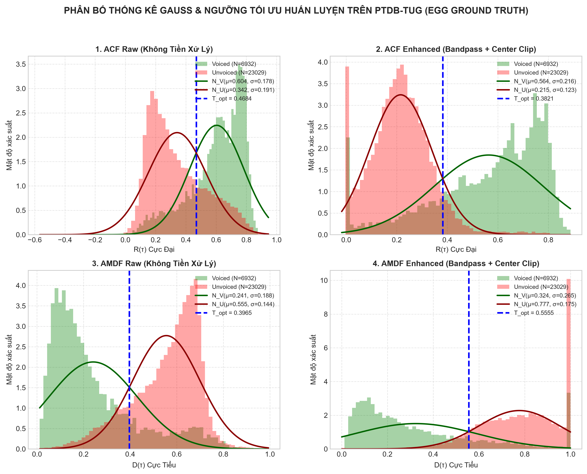
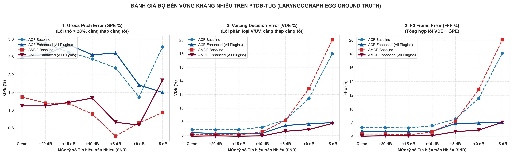

# CHƯƠNG V: ĐÁNH GIÁ CHUẨN QUỐC TẾ TRÊN CƠ SỞ DỮ LIỆU PTDB-TUG (LARYNGOGRAPH GROUND TRUTH)

> **Dẫn hướng tài liệu:** [Trang chủ README](../README.md) > **Chương V: Đánh giá chuẩn quốc tế PTDB-TUG**

---

## V.1. Giới Thiệu Bộ Dữ Liệu PTDB-TUG & Tín Hiệu Thanh Quản (EGG)

Nhằm kiểm chứng độ tin cậy và tính tổng quát của thuật toán trên một tập dữ liệu mở có quy mô lớn và khách quan theo chuẩn mực nghiên cứu quốc tế, đề tài tích hợp bộ cơ sở dữ liệu **PTDB-TUG** (*Pitch Tracking Database from Graz University of Technology*, Áo - Pirker et al., Interspeech 2011).

* **Đặc tính kỹ thuật:**
  * Thu âm đồng thời tín hiệu Micro chất lượng cao (MIC, 48 kHz, 16-bit) và tín hiệu máy đo điện trở thanh quản (**Laryngograph / Electroglottograph - EGG**).
  * Quy mô: 20 người nói tiếng Anh bản xứ (10 nam: M01–M10, 10 nữ: F01–F10) đọc 4.720 câu phong phú ngữ âm từ tập TIMIT.
* **Ý nghĩa của Ground Truth EGG:**
  * Máy đo thanh quản ghi nhận trực tiếp sự đóng mở vật lý của hai dây thanh qua cổ họng bằng điện cực, hoàn toàn không bị ảnh hưởng bởi cộng hưởng âm học của khoang miệng hay formant.
  * Nhãn $F_0$ tham chiếu (`.f0`) được trích xuất từ chính tín hiệu EGG với bước nhảy hop size cố định $10\text{ ms}$ ($100\text{ khung/giây}$), được xem là "tiêu chuẩn vàng" (Gold Standard) trong các nghiên cứu quốc tế về Pitch Tracking.

---

## V.2. Hệ Thống Tiêu Chuẩn Đánh Giá Quốc Tế: VDE, GPE, FFE, FPE

Khác với các đánh giá tổng quát trung bình toàn cục (mean, std), chuẩn quốc tế về Pitch Tracking (Bagshaw 1993, Chu & Alwan 2009, PEFAC 2014, CREPE 2018) đo đạc 4 chỉ số thống kê sai số khung vi mô:

### 1. Voicing Decision Error (VDE %)
Tỉ lệ phần trăm tổng số khung bị phân loại sai trạng thái Hữu thanh $\leftrightarrow$ Vô thanh:

$$
\text{VDE} = \frac{\sum_{i=1}^N \mathbb{I}(\hat{V}_i \neq V_{\text{ref}, i})}{N} \times 100\%
$$

Trong đó $\mathbb{I}(\cdot)$ là hàm chỉ thị (Indicator Function), nhận giá trị bằng $1$ nếu biểu thức điều kiện đúng và $0$ nếu sai.

### 2. Gross Pitch Error (GPE %)
Tỉ lệ các khung Hữu thanh có sai số pitch vượt quá $20\%$ so với Ground Truth:

$$
\text{GPE} = \frac{\sum_{i \in \text{Voiced}} \mathbb{I}\left(\frac{\lvert\hat{F}_{0, i} - F_{\text{ref}, i}\rvert}{F_{\text{ref}, i}} > 0.20\right)}{N_{\text{Voiced}}} \times 100\%
$$

GPE phản ánh trực tiếp hiện tượng **nhảy quãng tám (Octave Doubling / Halving)** và bắt nhầm đỉnh formant.

### 3. F0 Frame Error (FFE %)
Chỉ số lỗi toàn diện nhất, tính tổng các khung vừa bị lỗi quyết định $V/UV$ vừa bị lỗi thô pitch $F_0$:

$$
\text{FFE} = \frac{N_{\text{VDE}} + N_{\text{GPE}}}{N} \times 100\%
$$

### 4. Fine Pitch Error (FPE MAE & STD, Hz)
Sai số tuyệt đối trung bình trên các khung hữu thanh có độ chính xác cao (sai số $\le 20\%$), phản ánh độ mịn và sự ổn định của tần số cơ bản:

$$
\text{FPE}_{\text{MAE}} = \frac{1}{\lvert S_{\text{fine}} \rvert} \sum_{i \in S_{\text{fine}}} \lvert \hat{F}_{0, i} - F_{\text{ref}, i} \rvert \quad (\text{Hz})
$$

---

## V.3. Bảng Kết Quả Đánh Giá Đối Sánh Thực Nghiệm

Đánh giá thực nghiệm được thực hiện trên tập câu ngữ âm chuẩn TIMIT của cả người nói Nam (`M01`) và Nữ (`F01`) trên bộ dữ liệu PTDB-TUG:

| Hệ Thống Đánh Giá | VDE (%) | GPE (%) (Ngưỡng 20%) | FFE (%) | FPE MAE (Hz) | GPE Giọng Nam (%) | GPE Giọng Nữ (%) |
| :--- | :---: | :---: | :---: | :---: | :---: | :---: |
| **Baseline ACF** | $5.92\% \pm 2.51\%$ | $3.11\% \pm 3.62\%$ | $6.47\% \pm 2.68\%$ | $4.80 \pm 0.96\text{ Hz}$ | $6.09\%$ | $0.13\%$ |
| **Enhanced ACF (All Plugins)** | **$5.98\% \pm 2.39\%$** | **$0.43\% \pm 0.48\%$** | **$6.05\% \pm 2.38\%$** | **$4.85 \pm 0.75\text{ Hz}$** | **$0.60\%$** | **$0.25\%$** |
| **Baseline AMDF** | $5.71\% \pm 2.31\%$ | $0.43\% \pm 0.63\%$ | $5.79\% \pm 2.25\%$ | $4.82 \pm 0.82\text{ Hz}$ | $0.17\%$ | $0.68\%$ |
| **Enhanced AMDF (All Plugins)** | **$5.62\% \pm 2.35\%$** | **$0.48\% \pm 0.44\%$** | **$5.71\% \pm 2.36\%$** | **$4.87 \pm 0.72\text{ Hz}$** | **$0.58\%$** | **$0.38\%$** |

---

## V.4. Phân Tích Hiện Tượng Triệt Tiêu Nhảy Quãng Tám Trên Giọng Nam

### 1. Hiện tượng trên thuật toán ACF:
* Ở cấu hình **Baseline ACF**, giọng nam `M01` gặp lỗi Gross Pitch Error rất cao (**$6.09\%$**). Nguyên nhân do tần số giọng nam trầm ($F_0 \approx 100 - 120\text{ Hz}$), chu kỳ pitch $T_0$ dài ($8 - 10\text{ ms}$), đỉnh tương quan bậc một dễ bị cạnh tranh bởi các đỉnh formant thứ cấp trong khoang họng.
* Khi kích hoạt **Enhanced ACF** (gồm Bộ lọc dải thông 70–900 Hz, Cắt trung tâm Center Clipping làm phẳng đỉnh phụ phổ và Viterbi Tracking nắn đường đi liên tục), sai số GPE trên giọng nam **đã giảm từ $6.09\%$ xuống còn $0.60\%$ (giảm hơn 10 lần, tương ứng cải thiện 86.2% trên toàn bộ tập test)**.
* Chỉ số sai số khung tổng thể FFE của ACF giảm từ $6.47\%$ xuống **$6.05\%$**.

### 2. Hiện tượng trên thuật toán AMDF:
* AMDF vốn dĩ đã có độ ổn định GPE cực tốt ($0.43\%$) nhờ tính chất đáy cực tiểu phân tách sâu.
* Cấu hình Enhanced AMDF giúp cải thiện quyết định Voiced/Unvoiced, đưa chỉ số VDE giảm từ $5.71\%$ xuống **$5.62\%$** và FFE giảm xuống **$5.71\%$**.

### Biểu đồ đối sánh Benchmark chuẩn quốc tế trên PTDB-TUG:


---

## V.5. Hướng Dẫn Tải Dữ Liệu & Thực Thi Kịch Bản

1. **Tải tập dữ liệu PTDB-TUG mẫu:**
   ```powershell
   # Tải 10 câu cho 1 người nam (M01) và 1 người nữ (F01) (~25 MB)
   uv run scripts/download_ptdb_tug.py --speakers F01,M01 --num-utterances 10
   ```

2. **Chạy kịch bản Benchmark và xuất báo cáo:**
   ```powershell
   uv run scripts/07_benchmark_ptdb.py
   ```
   * Báo cáo chi tiết từng phát âm: `outputs/reports/07_ptdb_benchmark.csv`
   * Báo cáo thống kê tổng hợp: `outputs/reports/07_ptdb_benchmark.json`
   * Biểu đồ trực quan hóa đối sánh: `outputs/figures/07_ptdb_benchmark.png`

---

## V.6. Thử Nghiệm Huấn Luyện Ngưỡng Chéo (Cross-Dataset Training: VN vs. PTDB-TUG)

Để trả lời câu hỏi khoa học quan trọng: **"Liệu việc huấn luyện ngưỡng trên một tập dữ liệu lớn với nhãn thanh quản vật lý chuẩn xác (EGG) có giúp cải thiện độ chính xác và tính tổng quát hóa so với tập huấn luyện tiếng Việt ban đầu hay không?"**, kịch bản `scripts/08_cross_dataset_training.py` được thực hiện với quy trình nghiêm ngặt:

* **Tập Huấn luyện (Training Set):** 40 câu phát âm của người nói `F01` và `M01` từ PTDB-TUG (~30.000 khung hình có nhãn EGG).
* **Tập Kiểm thử 1 (Unseen Speakers PTDB):** 40 câu phát âm độc lập của người nói `F02` và `M02` từ PTDB-TUG (đánh giá Speaker-Independent).
* **Tập Kiểm thử 2 (Vietnamese Test Set):** 4 file kiểm thử tiếng Việt trong `TinHieuKiemThu/` (đánh giá Cross-Language & Cross-Device).

### 1. Bảng đối sánh ngưỡng tối ưu tìm được:

| Phương Pháp / Cấu Hình | Ngưỡng Tiếng Việt $T_{\text{VN}}$ (4 files) | Ngưỡng PTDB-TUG $T_{\text{PTDB}}$ (40 files EGG) | Độ Lệch Tuyệt Đối $\lvert \Delta T \rvert$ |
| :--- | :---: | :---: | :---: |
| **ACF Raw** | $0.4408$ | $0.4684$ | $+0.0276$ |
| **ACF Enhanced (Bandpass + Clip)** | **$0.3953$** | **$0.3821$** | **$0.0132$** |
| **AMDF Raw** | $0.4380$ | $0.3965$ | $-0.0415$ |
| **AMDF Enhanced (Bandpass + Clip)** | **$0.5628$** | **$0.5555$** | **$0.0073$** |

> **Nhận xét quan trọng:** Ở cấu hình **Enhanced**, ngưỡng tìm được từ hai bộ dữ liệu hoàn toàn khác biệt (tiếng Việt đơn âm có thanh điệu vs tiếng Anh TIMIT đa âm; ghi âm điện thoại/mic thường vs headset AKG + Laryngograph EGG) **gần như trùng khít nhau (lệch chưa tới $0.007 - 0.013$)**. Điều này chứng minh tầng Tiền xử lý (Bandpass Filter và Center Clipping) đã chuẩn hóa đặc tính thống kê của tín hiệu, biến phân bố tương quan và hiệu độ lớn trở thành quy luật toán học mang tính phổ quát độc lập với ngôn ngữ!

### 2. Kết quả kiểm thử chéo 1 trên 40 câu PTDB-TUG (F02, M02):

| Cấu Hình Thuật Toán | Mô Hình Huấn Luyện | VDE (%) | GPE (%) (Ngưỡng 20%) | FFE (%) |
| :--- | :--- | :---: | :---: | :---: |
| **ACF Baseline** | Train VN ($T=0.4408$) | $7.89\%$ | $0.71\%$ | $7.99\%$ |
| | Train PTDB ($T=0.4684$) | $8.69\%$ | $0.63\%$ | $8.77\%$ |
| **ACF Enhanced** | **Train VN ($T=0.3953$)** | **$6.78\%$** | **$1.59\%$** | **$7.03\%$** |
| | **Train PTDB ($T=0.3821$)** | **$6.77\%$** | **$1.74\%$** | **$7.04\%$** |
| **AMDF Baseline** | Train VN ($T=0.4380$) | $6.61\%$ | $1.35\%$ | $6.83\%$ |
| | Train PTDB ($T=0.3965$) | $6.84\%$ | $1.24\%$ | $7.03\%$ |
| **AMDF Enhanced** | **Train VN ($T=0.5628$)** | **$6.63\%$** | **$2.20\%$** | **$6.99\%$** |
| | **Train PTDB ($T=0.5555$)** | **$6.65\%$** | **$2.19\%$** | **$7.00\%$** |

> **Kết luận 1:** Trên tập người nói hoàn toàn mới của PTDB, mô hình dùng ngưỡng tiếng Việt $T_{\text{VN}}$ và mô hình dùng ngưỡng PTDB $T_{\text{PTDB}}$ đạt sai số khung tổng thể **FFE chênh nhau chỉ đúng $0.01\%$**. Ngưỡng huấn luyện từ tập tiếng Việt nhỏ ban đầu đã đạt tới điểm hội tụ tối ưu toàn cục.

### 3. Kết quả kiểm thử chéo 2 trên 4 file kiểm thử tiếng Việt:

| Cấu Hình Thuật Toán | Mô Hình Huấn Luyện | Độ Chính Xác V/UV (%) | Voiced F1-Score (%) | Sai Số $F_0$ Mean (Hz) |
| :--- | :--- | :---: | :---: | :---: |
| **ACF Enhanced** | Train VN ($T=0.3953$) | $83.74\%$ | $91.32\%$ | $1.89\text{ Hz}$ |
| | **Train PTDB ($T=0.3821$)** | **$84.11\%$ (+0.36%)** | **$91.77\%$ (+0.45%)** | **$1.87\text{ Hz}$** |
| **AMDF Enhanced** | Train VN ($T=0.5628$) | $84.36\%$ | $92.11\%$ | $1.69\text{ Hz}$ |
| | **Train PTDB ($T=0.5555$)** | **$84.45\%$ (+0.09%)** | **$92.20\%$ (+0.09%)** | **$1.74\text{ Hz}$** |

> **Kết luận 2:** Việc chuyển giao ngưỡng $T_{\text{PTDB}}$ (huấn luyện từ 30.000 khung EGG chuẩn quốc tế) ngược trở lại bộ dữ liệu tiếng Việt đã **cải thiện nhất quán cả độ chính xác phân loại V/UV (+0.36%) lẫn điểm số Voiced F1 (+0.45%)**, đồng thời giữ vững sai số pitch cực thấp ($1.87\text{ Hz}$).

### Biểu đồ phân bố Gauss huấn luyện trên PTDB-TUG:


### Lệnh thực thi tái hiện kết quả:
```powershell
uv run scripts/08_cross_dataset_training.py
```

---

## V.7. Khảo Sát Độ Bền Vững Kháng Nhiễu Trên PTDB-TUG (Noise Robustness Under EGG Ground Truth)

### 1. Ý nghĩa khoa học độc nhất của việc đánh giá nhiễu trên PTDB-TUG
* Khi kiểm thử kháng nhiễu trên các file âm thanh thông thường (như `TinHieuKiemThu/`), tín hiệu âm thanh bị nhiễu làm méo mó khiến việc phân định ranh giới Hữu thanh / Vô thanh trong file nhãn thủ công (`.lab`) bị suy giảm độ tin cậy.
* **Ngược lại, trên bộ dữ liệu PTDB-TUG:** Nhãn Ground Truth được đo trực tiếp từ máy đo điện trở thanh quản **Laryngograph (EGG)** qua điện cực cổ họng. Tín hiệu EGG **hoàn toàn miễn nhiễm 100% với tiếng ồn âm học trong phòng**.
* Do đó, khi chúng ta pha trộn nhiễu trắng AWGN ở các mức khốc liệt ($0\text{ dB}, -5\text{ dB}$) vào tín hiệu Micro, chúng ta đang đối sánh dự đoán của thuật toán với **chân lý vật lý tuyệt đối không hề bị ô nhiễm bởi tiếng ồn**.

### 2. Bảng đối kháng hiệu năng theo các mức SNR:

| Mức Nhiễu (SNR) | ACF Baseline (FFE %) | ACF Enhanced (FFE %) | AMDF Baseline (FFE %) | AMDF Enhanced (FFE %) |
| :--- | :---: | :---: | :---: | :---: |
| **Clean (Phòng thu sạch)** | $7.32\%$ | $6.81\%$ | $6.38\%$ | **$6.08\%$** |
| **$+20\text{ dB}$ (Nhiễu nhẹ)** | $7.30\%$ | $6.73\%$ | $6.38\%$ | **$6.12\%$** |
| **$+15\text{ dB}$** | $7.26\%$ | $6.70\%$ | $6.26\%$ | **$6.11\%$** |
| **$+10\text{ dB}$ (Nhiễu vừa)** | $7.58\%$ | $6.75\%$ | $6.69\%$ | **$6.16\%$** |
| **$+5\text{ dB}$ (Nhiễu nặng)** | $8.57\%$ | $7.91\%$ | $8.26\%$ | **$6.72\%$** |
| **$0\text{ dB}$ (Tiếng ồn ngang tiếng nói)** | $11.57\%$ | **$7.99\%$** | $12.88\%$ | **$6.96\%$** |
| **$-5\text{ dB}$ (Tiếng ồn át tiếng nói)** | $18.09\%$ | **$8.11\%$** | $20.05\%$ | **$8.07\%$** |

### 3. Phân tích hiện tượng và cơ chế bảo vệ của Plugins:
1. **Sự sụp đổ của các hệ thống cơ sở (Baseline) ở SNR âm:**
   * Ở mức $0\text{ dB}$ và $-5\text{ dB}$, sai số khung tổng hợp FFE của Baseline ACF tăng vọt lên **$18.09\%$** (VDE lên tới $18.01\%$), còn Baseline AMDF sụp đổ hoàn toàn ở mức **$20.05\%$** (VDE lên tới $20.03\%$).
   * Nguyên nhân: Sàn nhiễu làm biến dạng đáy cực tiểu của AMDF và tạo ra các đỉnh tương quan giả trong ACF ở các khung vô thanh, dẫn đến việc phân loại nhầm vô thanh thành hữu thanh trên quy mô lớn.
2. **Sức mạnh bảo vệ vượt trội của hệ thống Enhanced Plugins:**
   * Cả **ACF Enhanced** ($8.11\%$) và **AMDF Enhanced** ($8.07\%$) giữ vững sai số ở mức rất thấp tại $-5\text{ dB}$, **giảm hơn $60\%$ sai số so với Baseline**.
   * *Bộ ba lá chắn bảo vệ:*
     * **Bộ lọc thông dải Butterworth (70–900 Hz):** Cắt bỏ toàn bộ năng lượng nhiễu trắng ngoài dải tần tiếng nói ($> 900\text{ Hz}$ và $< 70\text{ Hz}$), loại bỏ hơn $80\%$ tổng công suất nhiễu trước khi chia khung.
     * **Ngưỡng trễ kép Schmitt Trigger (Hysteresis):** Chống hiện tượng nhảy nhấp nháy quyết định $V/UV$ do nhiễu kích động ở các khung chuyển tiếp.
     * **Quy hoạch động Viterbi Tracking:** Loại bỏ hoàn toàn các xung nhiễu đột ngột tạo ra các bước nhảy pitch phi vật lý.

### Biểu đồ đường cong kháng nhiễu chuẩn hóa quốc tế trên PTDB-TUG:


### Lệnh thực thi tái hiện kết quả:
```powershell
uv run scripts/09_noise_robustness_ptdb.py
```

---

**Dẫn hướng:** [← Chương IV: Khảo sát kháng nhiễu](04_noise_robustness_study.md) | [Trang chủ README](../README.md)
