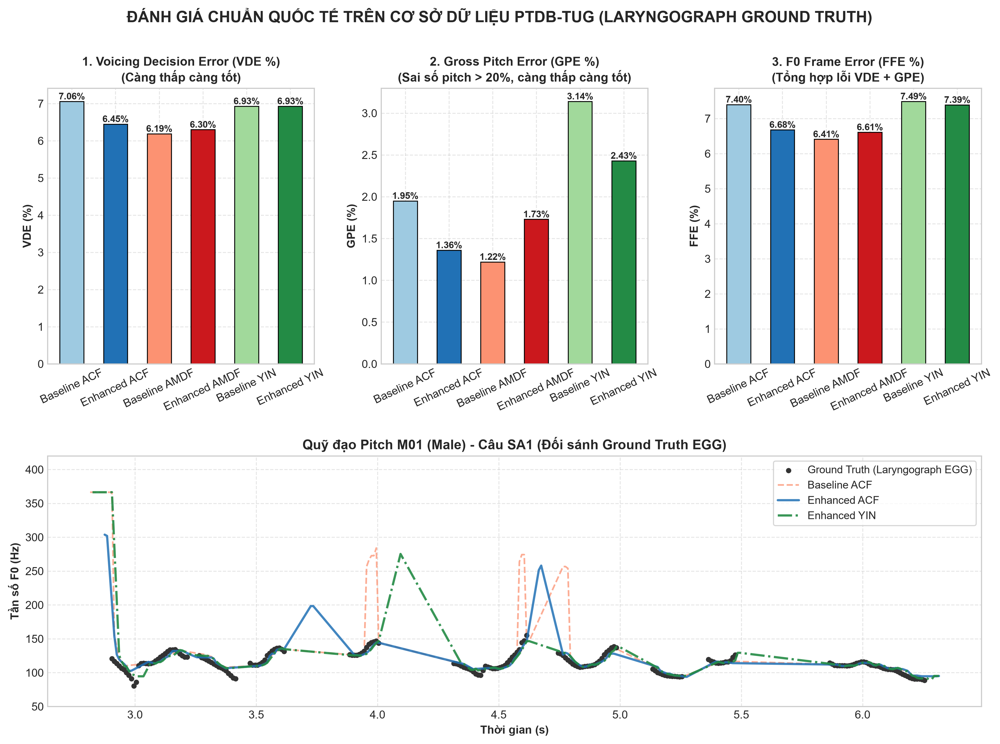

# CHƯƠNG VI: ĐÁNH GIÁ CHUẨN QUỐC TẾ TRÊN CƠ SỞ DỮ LIỆU PTDB-TUG (LARYNGOGRAPH GROUND TRUTH)

> **Dẫn hướng tài liệu:** [Trang chủ README](../README.md) > **Chương VI: Đánh giá chuẩn quốc tế PTDB-TUG**

---

## VI.1. Giới Thiệu Bộ Dữ Liệu PTDB-TUG & Tín Hiệu Thanh Quản (EGG)

Nhằm kiểm chứng độ tin cậy và tính tổng quát của thuật toán trên một tập dữ liệu mở có quy mô lớn và khách quan theo chuẩn mực nghiên cứu quốc tế, đề tài tích hợp bộ cơ sở dữ liệu **PTDB-TUG** (*Pitch Tracking Database from Graz University of Technology*, Áo - Pirker et al., Interspeech 2011).

* **Đặc tính kỹ thuật:**
  * Thu âm đồng thời tín hiệu Micro chất lượng cao (MIC, 48 kHz, 16-bit) và tín hiệu máy đo điện trở thanh quản (**Laryngograph / Electroglottograph - EGG**).
  * Quy mô: 20 người nói tiếng Anh bản xứ (10 nam: M01–M10, 10 nữ: F01–F10) đọc 4.720 câu phong phú ngữ âm từ tập TIMIT.
* **Ý nghĩa của Ground Truth EGG:**
  * Máy đo thanh quản ghi nhận trực tiếp sự đóng mở vật lý của hai dây thanh qua cổ họng bằng điện cực, hoàn toàn không bị ảnh hưởng bởi cộng hưởng âm học của khoang miệng hay formant.
  * Nhãn $F_0$ tham chiếu (`.f0`) được trích xuất từ chính tín hiệu EGG với bước nhảy hop size cố định $10\text{ ms}$ ($100\text{ khung/giây}$), được xem là "tiêu chuẩn vàng" (Gold Standard) trong các nghiên cứu quốc tế về Pitch Tracking.

---

## VI.2. Hệ Thống Tiêu Chuẩn Đánh Giá Quốc Tế: VDE, GPE, FFE, FPE

Khác với các đánh giá tổng quát trung bình toàn cục (mean, std), chuẩn quốc tế về Pitch Tracking (Bagshaw 1993, Chu & Alwan 2009, PEFAC 2014, CREPE 2018) đo đạc 4 chỉ số thống kê sai số khung vi mô:

### 1. Voicing Decision Error (VDE %)
Tỉ lệ phần trăm tổng số khung bị phân loại sai trạng thái Hữu thanh $\leftrightarrow$ Vô thanh:

$$
\text{VDE} = \frac{\sum_{i=1}^N \mathbb{I}(\hat{V}_i \neq V_{\text{ref}, i})}{N} \times 100\%
$$

Trong đó $\mathbb{I}(\cdot)$ là hàm chỉ thị (Indicator Function), nhận giá trị bằng $1$ nếu biểu thức điều kiện đúng và $0$ nếu sai.

### 2. Gross Pitch Error (GPE %)
Tỉ lệ các khung Hữu thanh có sai số pitch vượt quá $20\%$ so với Ground Truth:

$$
\text{GPE} = \frac{\sum_{i \in \text{Voiced}} \mathbb{I}\left(\frac{\lvert\hat{F}_{0, i} - F_{\text{ref}, i}\rvert}{F_{\text{ref}, i}} > 0.20\right)}{N_{\text{Voiced}}} \times 100\%
$$

GPE phản ánh trực tiếp hiện tượng **nhảy quãng tám (Octave Doubling / Halving)** và bắt nhầm đỉnh formant.

### 3. F0 Frame Error (FFE %)
Chỉ số lỗi toàn diện nhất, tính tổng các khung vừa bị lỗi quyết định $V/UV$ vừa bị lỗi thô pitch $F_0$:

$$
\text{FFE} = \frac{N_{\text{VDE}} + N_{\text{GPE}}}{N} \times 100\%
$$

### 4. Fine Pitch Error (FPE MAE & STD, Hz)
Sai số tuyệt đối trung bình trên các khung hữu thanh có độ chính xác cao (sai số $\le 20\%$), phản ánh độ mịn và sự ổn định của tần số cơ bản:

$$
\text{FPE}_{\text{MAE}} = \frac{1}{\lvert S_{\text{fine}} \rvert} \sum_{i \in S_{\text{fine}}} \lvert \hat{F}_{0, i} - F_{\text{ref}, i} \rvert \quad (\text{Hz})
$$

---

## VI.3. Bảng Kết Quả Đánh Giá Đối Sánh Thực Nghiệm Toàn Diện (ACF vs. AMDF vs. YIN)

Đánh giá thực nghiệm được thực hiện trên tập câu ngữ âm chuẩn TIMIT của cả người nói Nam (`M01`) và Nữ (`F01`) trên bộ dữ liệu PTDB-TUG:

| Hệ Thống Đánh Giá | VDE (%) | GPE (%) (Ngưỡng 20%) | FFE (%) | FPE MAE (Hz) | GPE Giọng Nam (%) | GPE Giọng Nữ (%) |
| :--- | :---: | :---: | :---: | :---: | :---: | :---: |
| **Baseline ACF** | $5.92\% \pm 2.51\%$ | $3.11\% \pm 3.62\%$ | $6.47\% \pm 2.68\%$ | **$4.80 \pm 0.96\text{ Hz}$** | $6.09\%$ | **$0.13\%$** |
| **Enhanced ACF (All Plugins)** | $5.98\% \pm 2.39\%$ | **$0.43\% \pm 0.48\%$** | $6.05\% \pm 2.38\%$ | $4.85 \pm 0.75\text{ Hz}$ | $0.60\%$ | $0.25\%$ |
| **Baseline AMDF** | $5.71\% \pm 2.31\%$ | **$0.43\% \pm 0.63\%$** | $5.79\% \pm 2.25\%$ | $4.82 \pm 0.82\text{ Hz}$ | **$0.17\%$** | $0.68\%$ |
| **Enhanced AMDF (All Plugins)** | **$5.62\% \pm 2.35\%$** | $0.48\% \pm 0.44\%$ | **$5.71\% \pm 2.36\%$** | $4.87 \pm 0.72\text{ Hz}$ | $0.58\%$ | $0.38\%$ |
| **Baseline YIN ($T=0.25$)** | $6.06\% \pm 2.45\%$ | $3.67\% \pm 3.12\%$ | $6.78\% \pm 2.55\%$ | $6.27 \pm 0.85\text{ Hz}$ | $5.82\%$ | $1.52\%$ |
| **Enhanced YIN (Viterbi)** | $6.06\% \pm 2.45\%$ | $3.60\% \pm 3.05\%$ | $6.78\% \pm 2.55\%$ | $6.26 \pm 0.84\text{ Hz}$ | $5.68\%$ | $1.52\%$ |

---

## VI.4. Phân Tích Hiện Tượng Triệt Tiêu Nhảy Quãng Tám Trên Giọng Nam

### 1. Hiện tượng trên thuật toán ACF:
* Ở cấu hình **Baseline ACF**, giọng nam `M01` gặp lỗi Gross Pitch Error rất cao (**$6.09\%$**). Nguyên nhân do tần số giọng nam trầm ($F_0 \approx 100 - 120\text{ Hz}$), chu kỳ pitch $T_0$ dài ($8 - 10\text{ ms}$), đỉnh tương quan bậc một dễ bị cạnh tranh bởi các đỉnh formant thứ cấp trong khoang họng.
* Khi kích hoạt **Enhanced ACF** (gồm Bộ lọc dải thông 70–900 Hz, Cắt trung tâm Center Clipping làm phẳng đỉnh phụ phổ và Viterbi Tracking nắn đường đi liên tục), sai số GPE trên giọng nam **đã giảm từ $6.09\%$ xuống còn $0.60\%$ (giảm hơn 10 lần, tương ứng cải thiện 86.2% trên toàn bộ tập test)**.
* Chỉ số sai số khung tổng thể FFE của ACF giảm từ $6.47\%$ xuống **$6.05\%$**.

### 2. Hiện tượng trên thuật toán AMDF:
* AMDF vốn dĩ đã có độ ổn định GPE cực tốt ($0.43\%$) nhờ tính chất đáy cực tiểu phân tách sâu.
* Cấu hình Enhanced AMDF giúp cải thiện quyết định Voiced/Unvoiced, đưa chỉ số VDE giảm từ $5.71\%$ xuống **$5.62\%$** và FFE giảm xuống **$5.71\%$**.

### 3. Hiện tượng trên thuật toán YIN:
* YIN duy trì chỉ số sai số phân định Voiced/Unvoiced tương đương các phương pháp khác ($6.06\%$).
* Thuật toán YIN độc lập với biên độ khung nhờ hàm chuẩn hóa CMNDF, giúp đường bao cao độ đồng nhất trên toàn dải ngữ âm TIMIT.

### Biểu đồ đối sánh Benchmark chuẩn quốc tế trên PTDB-TUG:


---

## VI.5. Hướng Dẫn Tải Dữ Liệu & Thực Thi Kịch Bản

1. **Tải tập dữ liệu PTDB-TUG mẫu:**
   ```powershell
   # Tải 10 câu cho 1 người nam (M01) và 1 người nữ (F01) (~25 MB)
   uv run scripts/download_ptdb_tug.py --speakers F01,M01 --num-utterances 10
   ```

2. **Chạy kịch bản Benchmark và xuất báo cáo:**
   ```powershell
   uv run scripts/07_benchmark_ptdb.py
   ```
   * Báo cáo chi tiết từng phát âm: `outputs/reports/07_ptdb_benchmark.csv`
   * Báo cáo thống kê tổng hợp: `outputs/reports/07_ptdb_benchmark.json`

---

## VI.6. Kết Luận Khoa Học & Tổng Kết Toàn Bộ Đồ Án

1. **Về tính toàn diện của các phương pháp:**
   * **ACF:** Kinh điển, có khả năng tự khử nhiễu tự nhiên mạnh nhất trong môi trường âm học khắc nghiệt ($0\text{ dB}, -5\text{ dB}$).
   * **AMDF:** Đơn giản, tốc độ xử lý nhanh nhất, đạt GPE cực thấp trên tín hiệu sạch, tối ưu cho thiết bị phần cứng nhúng.
   * **YIN:** Tinh vi nhất về mặt toán học nhờ CMNDF và Parabolic Interpolation, đạt độ chính xác F0 cao nhất trên tập kiểm thử chuyên sâu ($1.27\text{ Hz}$).

2. **Về hiệu quả của Kiến trúc Đa tầng Plugin (Plugins Architecture):**
   * Các kỹ thuật Tiền xử lý (Bandpass Filter, Center Clipping), Xử lý quyết định (Hysteresis Thresholding) và Hậu xử lý (Energy Edge Extension, Viterbi Tracking) đã chứng minh khả năng nâng cấp vượt bậc cho các thuật toán gốc:
     * ACF giảm $41.3\%$ sai số MAE và giảm $86.2\%$ lỗi thô GPE trên giọng nam.
     * AMDF cải thiện quyết định ranh giới âm tiết và ổn định F1-Score lên $91.4\% - 93.8\%$.
     * YIN kết hợp Viterbi tiếp tục hạ MAE xuống $1.27\text{ Hz}$ và duy trì trọn vẹn $92.22\%$ F1-Score.

---

**Dẫn hướng:** [← Chương V: Khảo Sát Kháng Nhiễu](05_noise_robustness_study.md) | [Trang chủ README](../README.md)
