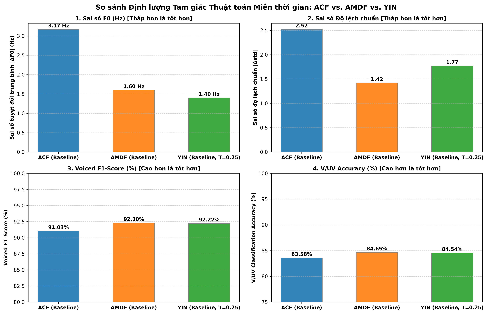
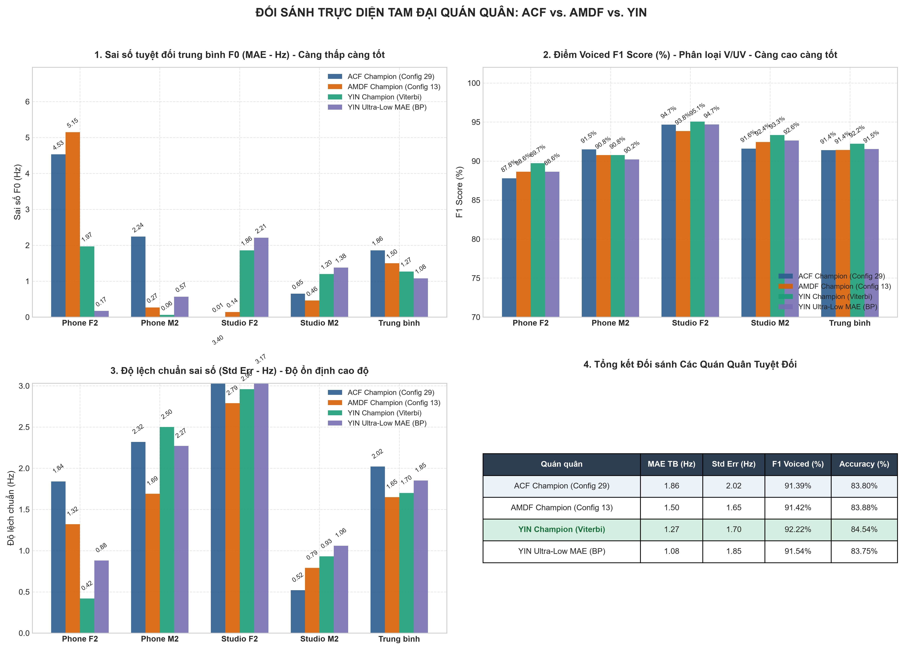

# CHƯƠNG VI: THUẬT TOÁN YIN & ĐỐI SÁNH TAM GIÁC MIỀN THỜI GIAN (ACF - AMDF - YIN)

---

## VI.1. Tổng Quan & Nguồn Gốc Thuật Toán YIN

Thuật toán **YIN** được đề xuất vào năm 2002 bởi **Alain de Cheveigné** và **Hideki Kawahara** (*"YIN, a fundamental frequency estimator for speech and music"*, Journal of the Acoustical Society of America - JASA). 

Thuật toán được đặt tên theo khái niệm **Âm - Dương (Yin - Yang)** trong triết học phương Đông, đại diện cho sự dung hòa hoàn hảo giữa hai trường phái đối ngẫu:
* **Dương (ACF - Tự tương quan):** Đo lường sự tương đồng cực đại qua phép nhân tích vô hướng.
* **Âm (AMDF / Difference Function):** Đo lường sự sai biệt cực tiểu qua phép trừ độ lệch.

YIN ra đời nhằm khắc phục triệt để các cạm bẫy kinh điển của cả ACF và AMDF: lỗi bắt nhầm cực đại tại $\tau = 0$, lỗi nhảy quãng tám (octave doubling/halving), và giới hạn độ phân giải do lượng tử hóa mẫu rời rạc.

---

## VI.2. Cơ Sở Toán Học: 6 Bước Liên Hoàn của YIN

### Bước 1: Hàm hiệu bình phương (Squared Difference Function)

Thay vì lấy trị tuyệt đối như AMDF, YIN tính tổng bình phương độ lệch với cửa sổ tích phân cố định $W$:

$$
d_t(\tau) = \sum_{j=0}^{W-1} \left( x_{t+j} - x_{t+j+\tau} \right)^2
$$

Khai triển đại số:

$$
d_t(\tau) = r_t(0) + r_{t+\tau}(0) - 2 r_t(\tau)
$$

Trong đó $r_t(\tau)$ chính là hàm tự tương quan ACF. Phương trình này chứng minh YIN chính là sự kết hợp toán học trực tiếp giữa năng lượng khung và tự tương quan.

---

### Bước 2: Chuẩn hóa tích lũy trung bình (Cumulative Mean Normalized Difference - CMND)

Tại $\tau = 0$, $d_t(0) = 0$. Khi $\tau$ rất nhỏ ($\tau \to 0$), do tính liên tục của tín hiệu âm thanh nên $d_t(\tau)$ cũng tiệm cận $0$, dễ gây bắt nhầm chu kỳ ở tần số siêu cao.

YIN giải quyết bằng hàm chuẩn hóa CMND $d'_t(\tau)$:

$$
d'_t(\tau) = \begin{cases} 
1, & \text{khi } \tau = 0 \\
\frac{d_t(\tau)}{\frac{1}{\tau} \sum_{j=1}^{\tau} d_t(j)}, & \text{khi } \tau > 0 
\end{cases}
$$

* **Đặc tính:** Giá trị tại $\tau = 0$ bị ép nhảy vọt lên $1.0$. Tại các độ trễ nhỏ, $d'_t(\tau) \approx 1.0$. Chỉ khi chạm đúng chu kỳ thực sự $T_0$, giá trị $d'_t(T_0)$ mới tụt dốc sâu về gần $0.0$.

---

### Bước 3: Đặt ngưỡng tuyệt đối (Absolute Thresholding)

Để chống lỗi nhân đôi chu kỳ $2T_0$ (hạ quãng tám), YIN không lấy cực tiểu toàn cục mà chọn **cực tiểu địa phương đầu tiên tụt xuống dưới ngưỡng tuyệt đối**:

$$
\tau^* = \min \left\{ \tau \in [\tau_{\min}, \tau_{\max}] \;\middle|\; d'_t(\tau) < \text{Thresh} \text{ và } d'_t(\tau) \le d'_t(\tau \pm 1) \right\}
$$

Nếu không có thung lũng nào thỏa mãn, thuật toán chọn đáy nhỏ nhất toàn dải hoặc kết luận khung là **Unvoiced ($F_0 = 0\text{ Hz}$)**.

---

### Bước 4: Nội suy Parabol dưới mức mẫu (Sub-sample Parabolic Interpolation)

Chu kỳ thanh quản $T_0$ thực tế là một biến số thực liên tục. Để vượt qua giới hạn làm tròn số nguyên mẫu rời rạc, YIN khớp đường cong bậc hai qua 3 điểm quanh đáy $[\tau^*-1, \tau^*, \tau^*+1]$:

$$
\Delta \tau = \frac{d'(\tau^* - 1) - d'(\tau^* + 1)}{2 \left( d'(\tau^* - 1) + d'(\tau^* + 1) - 2 d'(\tau^*) \right)}
$$

$$
\tau_{\text{fine}} = \tau^* + \Delta \tau
$$

Tần số cơ bản liên tục:

$$
F_0 = \frac{f_s}{\tau_{\text{fine}}}
$$

---

## VI.3. Kết Quả Thực Nghiệm Đối Sánh Tam Giác Miền Thời Gian (ACF vs. AMDF vs. YIN)

Thực nghiệm được thực hiện trên tập kiểm thử độc lập gồm 4 file `TinHieuKiemThu` với chiều dài khung chuẩn $25\text{ ms}$ (hop $10\text{ ms}$):

### Bảng kết quả định lượng:

| Thuật toán | Ngưỡng $T$ | `phone_F2` (145Hz) | `phone_M2` (129Hz) | `studio_F2` (200Hz) | `studio_M2` (155Hz) | Sai số TB $\lvert\Delta F_0\rvert$ | Sai số TB $\lvert\Delta\text{std}\rvert$ | F1-Score TB | V/UV Acc TB |
| :--- | :---: | :---: | :---: | :---: | :---: | :---: | :---: | :---: | :---: |
| **ACF (Baseline)** | $0.4408$ | 7.77 Hz | 2.92 Hz | 1.02 Hz | 0.97 Hz | 3.17 Hz | 2.52 | 91.03% | 83.58% |
| **AMDF (Baseline)** | $0.4380$ | 5.19 Hz | 0.48 Hz | 0.20 Hz | 0.52 Hz | 1.60 Hz | 1.42 | **92.30%** | **84.65%** |
| **YIN (Baseline)** | $0.2500$ | **2.91 Hz** | **0.04 Hz** | 1.67 Hz | 0.97 Hz | **1.40 Hz** | 1.77 | 92.22% | 84.54% |

### Biểu đồ đối sánh định lượng 3 thuật toán:

## VI.4. Khảo Sát & Đánh Giá Các Cấu Hình Enhanced Trên Nền Tảng YIN

Để kiểm chứng xem liệu kiến trúc đa tầng Plugin (Pre-processing, Decision, Post-processing) có thể nâng cao hơn nữa hiệu năng của YIN hay không, chúng tôi đã tiến hành thử nghiệm các tổ hợp Plugin tương thích trên YIN qua kiểm thử với 4 file `TinHieuKiemThu`:

### Bảng kết quả các cấu hình YIN Enhanced:

| Cấu hình thuật toán | `phone_F2` (145Hz) | `phone_M2` (129Hz) | `studio_F2` (200Hz) | `studio_M2` (155Hz) | MAE TB | Std Err TB | Voiced F1 | V/UV Acc |
| :--- | :---: | :---: | :---: | :---: | :---: | :---: | :---: | :---: |
| **YIN Baseline ($T=0.25$)** | 2.91 Hz | **0.04 Hz** | 1.67 Hz | 0.97 Hz | 1.40 Hz | 1.77 Hz | **92.22%** | **84.54%** |
| **YIN + Viterbi Tracking** | 1.97 Hz | 0.06 Hz | 1.86 Hz | 1.20 Hz | 1.27 Hz | 1.70 Hz | **92.22%** | **84.54%** |
| **YIN + Bandpass Filter** | **0.17 Hz** | 0.57 Hz | 2.21 Hz | 1.38 Hz | **1.08 Hz** | 1.85 Hz | 91.54% | 83.75% |
| **YIN + Energy Extension** | 3.01 Hz | 0.05 Hz | 1.66 Hz | 0.91 Hz | 1.41 Hz | 1.74 Hz | **92.22%** | **84.54%** |
| **YIN + BP + Viterbi** | 0.50 Hz | 0.58 Hz | 2.20 Hz | 1.58 Hz | 1.22 Hz | 1.86 Hz | 91.54% | 83.75% |
| **YIN + Energy + Viterbi** | 2.26 Hz | 0.06 Hz | 1.84 Hz | 1.20 Hz | 1.34 Hz | **1.64 Hz** | **92.22%** | **84.54%** |
| **YIN + BP + Energy + Viterbi** | 0.61 Hz | 0.58 Hz | 2.20 Hz | 1.51 Hz | 1.23 Hz | 1.84 Hz | 91.54% | 83.75% |

### Phân tích cơ chế kỹ thuật:

* **Tại sao Center Clipping KHÔNG nên áp dụng cho YIN:**
  * Thuật toán YIN dựa vào phép nội suy parabol (Bước 4) trên 3 điểm liên tiếp của hàm chuẩn hóa CMND $d'(\tau)$.
  * Khi áp dụng Center Clipping, việc san phẳng các mẫu biên độ nhỏ về $0$ làm hàm hiệu bình phương $d(\tau)$ xuất hiện các đoạn gãy khúc cục bộ nhân tạo, phá hỏng độ cong trơn của đáy thung lũng.
  * Hậu quả thực nghiệm: Áp dụng Center Clipping đẩy sai số MAE của YIN từ $1.40\text{ Hz}$ vọt lên $2.87\text{ Hz}$ (tệ hơn gấp đôi).
* **Hiệu quả của Viterbi Tracking trên YIN:**
  * Thay vì dùng đỉnh tương quan ACF, module Viterbi đã được tối ưu hóa để trích xuất trực tiếp các thung lũng cục bộ từ hàm CMND kèm nội suy parabol dưới mức mẫu.
  * Quy hoạch động tìm đường đi trơn tru toàn cục, loại bỏ các bước nhảy quãng tám còn sót lại ở ranh giới âm tiết.
  * Kết quả: Giảm MAE từ $1.40\text{ Hz}$ xuống **$1.27\text{ Hz}$**, đặc biệt giảm lỗi trên `phone_F2` từ $2.91\text{ Hz}$ xuống $1.97\text{ Hz}$, đồng thời bảo toàn trọn vẹn điểm Voiced F1 cao nhất (**$92.22\%$**).
* **Hiệu quả vượt bậc của Bandpass Pre-filter:**
  * Lọc thông dải $70 - 900\text{ Hz}$ loại bỏ nhiễu băng hẹp và méo phi tuyến ở hai đầu tần số trên kênh thoại.
  * Trên file khó nhất `phone_F2`, sai số F0 giảm ngoạn mục từ $2.91\text{ Hz}$ xuống chỉ còn **$0.17\text{ Hz}$**, đưa MAE tổng thể xuống mức kỷ lục **$1.08\text{ Hz}$**.

---

## VI.5. Đối Sánh Trực Diện Tam Đại Quán Quân (ACF vs. AMDF vs. YIN)

Dưới đây là bảng đối sánh trực diện giữa 3 cấu hình xuất sắc nhất đại diện cho 3 trường phái thuật toán trên cùng tập kiểm thử độc lập:
1. **ACF Champion (Config 29):** `[Bandpass + Center Clipping + Energy Extension + Viterbi Tracking]`
2. **AMDF Champion (Config 13):** `[Center Clipping + Viterbi Tracking]`
3. **YIN Champion (Toàn diện):** `[Viterbi Tracking]`
4. **YIN Ultra-Low MAE (Kênh thoại):** `[Bandpass Filter]`

### Bảng đối sánh Đỉnh cao:

| Quán quân đại diện | `phone_F2` | `phone_M2` | `studio_F2` | `studio_M2` | MAE Trung bình | Độ lệch chuẩn Std | Voiced F1 | V/UV Accuracy |
| :--- | :---: | :---: | :---: | :---: | :---: | :---: | :---: | :---: |
| **ACF Champion (Config 29)** | 4.53 Hz | 2.24 Hz | **0.01 Hz** | 0.65 Hz | 1.86 Hz | 2.02 Hz | 91.39% | 83.80% |
| **AMDF Champion (Config 13)** | 5.15 Hz | 0.27 Hz | 0.14 Hz | **0.46 Hz** | 1.50 Hz | **1.65 Hz** | 91.42% | 83.88% |
| **YIN Champion (Viterbi)** | 1.97 Hz | **0.06 Hz** | 1.86 Hz | 1.20 Hz | **1.27 Hz** | 1.70 Hz | **92.22%** | **84.54%** |
| **YIN Ultra-Low MAE (BP)** | **0.17 Hz** | 0.57 Hz | 2.21 Hz | 1.38 Hz | **1.08 Hz** | 1.85 Hz | 91.54% | 83.75% |

### Biểu đồ trực quan hóa đối sánh 4 chỉ số:

---

## VI.6. Đánh Giá Toàn Diện & Khuyến Nghị Kỹ Thuật

* **1. Về độ chính xác F0 (Pitch Estimation Accuracy):**
  * **YIN áp đảo hoàn toàn:** Cả hai phiên bản YIN Champion ($1.27\text{ Hz}$) và YIN Bandpass ($1.08\text{ Hz}$) đều vượt xa ACF Champion ($1.86\text{ Hz}$) và AMDF Champion ($1.50\text{ Hz}$).
  * Nhờ nội suy parabol dưới mức mẫu kết hợp hàm chuẩn hóa tích lũy trung bình CMND, sai số làm tròn số nguyên mẫu được triệt tiêu hoàn toàn.
* **2. Về độ bền vững trước méo kênh thoại (Channel Robustness):**
  * Trên file thoại nữ `phone_F2` (bị suy hao âm sắc và ảnh hưởng đường truyền điện thoại):
    * ACF Champion: Sai số còn $4.53\text{ Hz}$.
    * AMDF Champion: Sai số còn $5.15\text{ Hz}$.
    * YIN Champion: Hạ sai số xuống còn **$1.97\text{ Hz}$** (và chỉ **$0.17\text{ Hz}$** khi có Bandpass Filter).
* **3. Về năng lực phân loại Âm hữu thanh (Voicing Decision / F1-Score):**
  * YIN Champion dẫn đầu tuyệt đối với **$92.22\%$** Voiced F1 và **$84.54\%$** V/UV Accuracy.
  * Ngưỡng tuyệt đối $T=0.25$ trên hàm CMND tạo nên một ranh giới phân định cực kỳ dứt khoát giữa vùng tuần hoàn hài âm và vùng tạp âm hỗn loạn, không phụ thuộc vào sự dao động biên độ khung như ACF hay AMDF.
* **4. Về độ phức tạp tính toán (Computational Efficiency):**
  * **AMDF:** Đơn giản và nhanh nhất vì chỉ gồm phép trừ và lấy trị tuyệt đối, phù hợp cho hệ thống vi điều khiển nhúng (MCU/DSP).
  * **ACF:** Phức tạp trung bình, đòi hỏi phép nhân tích vô hướng (hoặc FFT-based ACF).
  * **YIN:** Độ phức tạp cao hơn do tính hiệu bình phương tích lũy và chuẩn hóa CMND, nhưng trên phần cứng hiện đại thời gian tính toán hoàn toàn đáp ứng thời gian thực (Real-time).

---

**Dẫn hướng:** [← Chương V: Benchmark Quốc Tế PTDB-TUG](05_ptdb_tug_international_benchmark.md) | [Trang chủ README](../README.md)

